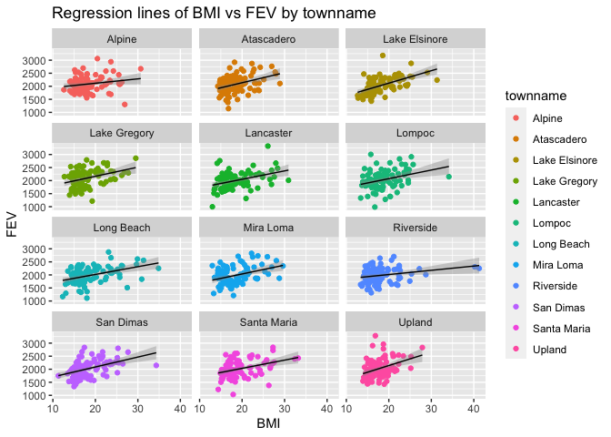
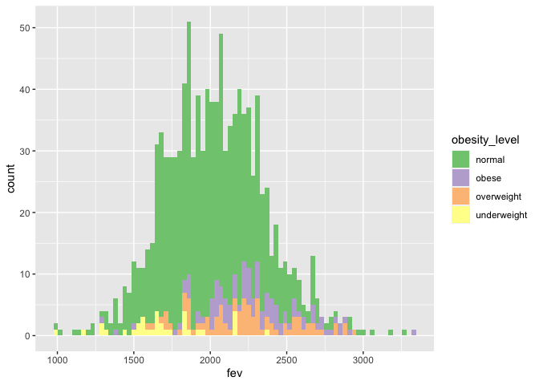
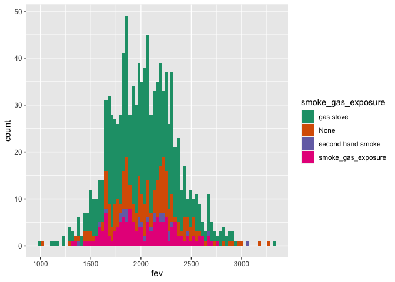
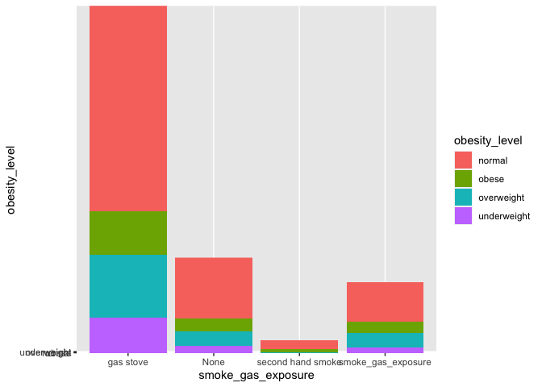
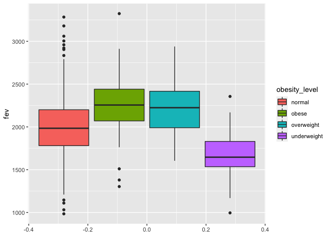
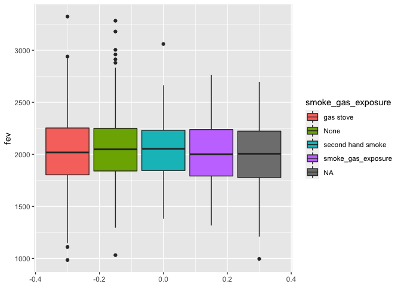
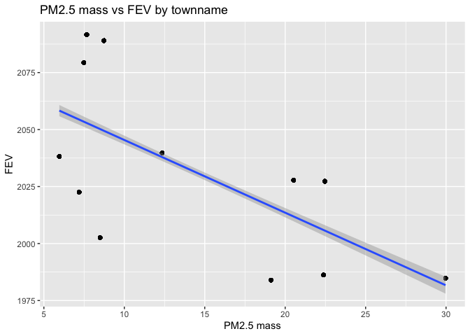

PM566\_ HW02
================
Luqing Ren
9/18/2020

\#load the data set

``` r
download.file(url = "https://github.com/USCbiostats/data-science-data/raw/master/01_chs/chs_regional.csv",destfile = "chs_regional.csv")
download.file(url = "https://github.com/USCbiostats/data-science-data/raw/master/01_chs/chs_individual.csv",destfile = "chs_individual.csv")
```

``` r
library(data.table)
region <- fread("chs_regional.csv")
individual<- fread("chs_individual.csv")
# merge two data sets
data <- merge( x= region, y= individual, by= "townname", all= TRUE)
```

``` r
# question 1: data wrangling
# 1) make sure you don’t have any duplicates by counting the number of rows
nrow(individual) == nrow(data)
```

    ## [1] TRUE

``` r
# 2) Create a new categorical variable named “obesity_level” and creat a summary table
# that contains the minimum BMI, maximum BMI, and the total number of observations per category.
library(tidyverse)
```

    ## ── Attaching packages ───────────────────────────── tidyverse 1.3.0 ──

    ## ✓ ggplot2 3.3.2     ✓ purrr   0.3.4
    ## ✓ tibble  3.0.3     ✓ dplyr   1.0.2
    ## ✓ tidyr   1.1.2     ✓ stringr 1.4.0
    ## ✓ readr   1.3.1     ✓ forcats 0.5.0

    ## ── Conflicts ──────────────────────────────── tidyverse_conflicts() ──
    ## x dplyr::between()   masks data.table::between()
    ## x dplyr::filter()    masks stats::filter()
    ## x dplyr::first()     masks data.table::first()
    ## x dplyr::lag()       masks stats::lag()
    ## x dplyr::last()      masks data.table::last()
    ## x purrr::transpose() masks data.table::transpose()

``` r
data <-
  data %>% 
  mutate(obesity_level = case_when(
    bmi <14 ~"underweight",
    bmi <22 ~"normal",
    bmi <24~ "overweight",
    bmi >24 ~"obese",
    TRUE ~ NA_character_
  ))
bmi_min <- data[, .SD[which.min(bmi)], by=obesity_level][,.(bmi,obesity_level)]
bmi_max <- data[, .SD[which.max(bmi)], by=obesity_level][,.(bmi,obesity_level)]
counts <- data[,.(Counts=length(bmi)), by=obesity_level]

#merge bmi_min and bmi_max, length and rename colnames. 
max_min <- merge(x=bmi_min, y=bmi_max, by="obesity_level", all=TRUE)
count_table <- merge(x=max_min, y = counts, by="obesity_level", all.x = TRUE, all.y = FALSE)
colnames(count_table) <- c("obesity_level", "bmi_min", "bmi_max","Total")
count_table
```

    ##    obesity_level  bmi_min  bmi_max Total
    ## 1:        normal 14.00380 21.96387   886
    ## 2:         obese 24.00647 41.26613   103
    ## 3:    overweight 22.02353 23.99650    87
    ## 4:   underweight 11.29640 13.98601    35

``` r
# 3) Create another categorical variable named “smoke_gas_exposure” that summarizes “Second Hand Smoke” and “Gas Stove.” The variable should have four categories in total
data <-
  data %>% 
  mutate(smoke_gas_exposure = case_when(
    smoke ==1 & gasstove==1 ~"smoke_gas_exposure",
    smoke ==1 & gasstove==0 ~"second hand smoke",
    smoke ==0 & gasstove==1~ "gas stove",
    smoke ==0 & gasstove==0 ~"None",
    TRUE ~ NA_character_
  ))
table(data$smoke_gas_exposure)
```

    ## 
    ##          gas stove               None  second hand smoke smoke_gas_exposure 
    ##                739                214                 36                151

``` r
# 4) Create four summary tables showing the average (or proportion, if binary) and sd of “Forced expiratory volume in 1 second (ml)” and asthma indicator by town, sex, obesity level, and “smoke_gas_exposure.”

# summary table by town
fev_ave <- data[, fev_ave := mean(fev, na.rm = T), by = townname][,.(fev_ave,townname)][,.SD[1], by=townname]
```

    ## Warning in `[.data.table`(data, , `:=`(fev_ave, mean(fev, na.rm = T)), by =
    ## townname): Invalid .internal.selfref detected and fixed by taking a (shallow)
    ## copy of the data.table so that := can add this new column by reference. At an
    ## earlier point, this data.table has been copied by R (or was created manually
    ## using structure() or similar). Avoid names<- and attr<- which in R currently
    ## (and oddly) may copy the whole data.table. Use set* syntax instead to avoid
    ## copying: ?set, ?setnames and ?setattr. If this message doesn't help, please
    ## report your use case to the data.table issue tracker so the root cause can be
    ## fixed or this message improved.

``` r
fev_sd <- data[, fev_sd := sd(fev, na.rm = T), by = townname][,.(fev_sd,townname)][,.SD[1], by=townname]
asthma_prop<- data[, prop := fifelse(asthma ==1, sum(.SD$asthma==1, na.rm = T)/.N,sum(.SD$asthma ==0,na.rm = T)/.N), by = townname][,.SD[1], by = townname][,.(townname,prop)]
summary_1 <-data.table(townname=fev_ave$townname, fev_ave=fev_ave$fev_ave, fev_sd=fev_sd$fev_sd, asthma_prop=asthma_prop$prop)
summary_1
```

    ##          townname  fev_ave   fev_sd asthma_prop
    ##  1:        Alpine 2089.014 298.2039        0.86
    ##  2:    Atascadero 2079.374 331.8782        0.73
    ##  3: Lake Elsinore 2039.787 317.6112        0.83
    ##  4:  Lake Gregory 2091.665 337.8286        0.84
    ##  5:     Lancaster 2002.550 337.1053        0.81
    ##  6:        Lompoc 2038.227 367.4474        0.86
    ##  7:    Long Beach 1983.896 330.6271        0.83
    ##  8:     Mira Loma 1984.726 336.6416        0.80
    ##  9:     Riverside 1986.212 289.7415        0.89
    ## 10:     San Dimas 2027.806 321.9740        0.82
    ## 11:   Santa Maria 2022.553 330.0457        0.84
    ## 12:        Upland 2027.284 357.2010        0.87

``` r
# summary table by sex
fev_ave_male <- data[, fev_ave := mean(fev, na.rm = T), by = male][,.(fev_ave,male)][,.SD[1], by=male]
fev_sd_male <- data[, fev_sd := sd(fev, na.rm = T), by = male][,.(fev_sd,male)][,.SD[1], by=male]
asthma_prop_male <- data[, prop := fifelse(asthma ==1, sum(.SD$asthma==1, na.rm = T)/.N,sum(.SD$asthma ==0,na.rm = T)/.N), by = male][,.SD[1], by = male][,.(male,prop)]
data[, male := factor(male, levels = c(0,1), labels = c("Female","Male"))]
summary_2 <-data.table(male=fev_ave_male$male, fev_ave_male=fev_ave_male$fev_ave, fev_sd_male=fev_sd_male$fev_sd, asthma_prop_male=asthma_prop_male$prop)
summary_2
```

    ##    male fev_ave_male fev_sd_male asthma_prop_male
    ## 1:    0     1959.105    327.2948        0.8590164
    ## 2:    1     2103.819    318.2036        0.8033898

``` r
# summary table by obesity level
fev_ave_ob <- data[, fev_ave := mean(fev, na.rm = T), by = obesity_level][,.(fev_ave,obesity_level)][,.SD[1], by=obesity_level]
fev_sd_ob <- data[, fev_sd := sd(fev, na.rm = T), by = obesity_level][,.(fev_sd,obesity_level)][,.SD[1], by=obesity_level]
asthma_prop_ob<- data[, prop := fifelse(asthma ==1, sum(.SD$asthma==1, na.rm = T)/.N,sum(.SD$asthma ==0,na.rm = T)/.N), by = obesity_level][,.SD[1], by = obesity_level][,.(obesity_level,prop)]
summary_3 <-data.table(obesity_level=fev_ave_ob$obesity_level, fev_ave=fev_ave_ob$fev_ave, fev_sd=fev_sd_ob$fev_sd, asthma_prop=asthma_prop_ob$prop)
summary_3
```

    ##    obesity_level  fev_ave   fev_sd asthma_prop
    ## 1:        normal 1997.974 309.4085   0.8386005
    ## 2:    overweight 2224.322 317.4261   0.8160920
    ## 3:         obese 2269.295 325.5054   0.2038835
    ## 4:          <NA>      NaN       NA   0.8202247
    ## 5:   underweight 1686.800 300.0803   0.9142857

``` r
## summary table by smoke_gas_exposure
fev_ave_gs <- data[, fev_ave := mean(fev, na.rm = T), by = smoke_gas_exposure][,.(fev_ave,smoke_gas_exposure)][,.SD[1], by=smoke_gas_exposure]
fev_sd_gs <- data[, fev_sd := sd(fev, na.rm = T), by = smoke_gas_exposure][,.(fev_sd,smoke_gas_exposure)][,.SD[1], by=smoke_gas_exposure]
asthma_prop_gs<- data[, prop := fifelse(asthma ==1, sum(.SD$asthma==1, na.rm = T)/.N,sum(.SD$asthma ==0,na.rm = T)/.N), by = smoke_gas_exposure][,.SD[1], by = smoke_gas_exposure][,.(smoke_gas_exposure,prop)]
summary_4 <-data.table(smoke_gas_exposure=fev_ave_gs$smoke_gas_exposure, fev_ave=fev_ave_gs$fev_ave, fev_sd=fev_sd_gs$fev_sd, asthma_prop=asthma_prop_gs$prop)
summary_4
```

    ##    smoke_gas_exposure  fev_ave   fev_sd asthma_prop
    ## 1:               None 2059.943 342.5625   0.8364486
    ## 2:               <NA> 1999.783 364.9553   0.6666667
    ## 3:  second hand smoke 2064.346 333.2266   0.8055556
    ## 4:          gas stove 2026.308 328.1240   0.8430311
    ## 5: smoke_gas_exposure 2019.974 313.2327   0.8410596

``` r
#question 2: EDA
# 1) check variables
summary(data$bmi)
```

    ##    Min. 1st Qu.  Median    Mean 3rd Qu.    Max.    NA's 
    ##   11.30   15.78   17.48   18.50   20.35   41.27      89

``` r
summary(data$fev)
```

    ##    Min. 1st Qu.  Median    Mean 3rd Qu.    Max.    NA's 
    ##   984.8  1809.0  2022.7  2031.3  2249.7  3323.7      95

``` r
# Facet plot showing scatterplots with regression lines of BMI vs FEV by “townname”
library(tidyverse)
library(ggplot2)
data %>% 
  filter(!(fev %in% NA)) %>% 
  filter(!(bmi %in% NA)) %>% 
  ggplot(mapping= aes(x= bmi, y= fev,color= townname))+
  geom_point()+
  geom_smooth(method = lm, color = "black",size = 0.5)+
  labs(title = "Regression lines of BMI vs FEV by townname", x= "BMI", y= "FEV")+
  facet_wrap(~townname, nrow=5)
```

    ## `geom_smooth()` using formula 'y ~ x'

<!-- -->

  - In each town, bmi has a positive relationship with fev.

<!-- end list -->

``` r
#2) Stacked histograms of FEV by BMI category  
data %>% 
   filter(!(fev %in% NA)) %>% 
   filter(!(bmi %in% NA)) %>%
   ggplot()+
   geom_histogram(mapping= aes(x= fev, fill = obesity_level), binwidth = 30)+
   scale_fill_brewer(palette = "Accent")
```

<!-- -->

\-There is a relatively normal distribution of fev in normal BMI people.
Most of people with normal BMI level have fev value around 2000.
Underweight group, overweight group and obesity group are not normally
distribution. Overweight and obesity groups are have relatively higher
fev than normal group.

``` r
# FEV by smoke/gas exposure. 
data %>% 
   filter(!(fev %in% NA)) %>% 
   filter(!(bmi %in% NA)) %>%
   filter(!(smoke_gas_exposure %in% NA)) %>%
   ggplot()+
   geom_histogram(mapping= aes(x= fev, fill = smoke_gas_exposure),binwidth = 30)+
   scale_fill_brewer(palette = "Dark2")
```

<!-- -->

  - fev value has the same distribution by smoke\_gas\_exposure. fev is
    not related with smoke/gas exposure.

<!-- end list -->

``` r
# 3) Bar-chart of BMI category by smoke/gas exposure category
data %>% 
   filter(!(fev %in% NA)) %>% 
   filter(!(bmi %in% NA)) %>%
   filter(!(smoke_gas_exposure %in% NA)) %>%
   ggplot()+
   geom_col(mapping = (aes(x = smoke_gas_exposure, y = obesity_level, fill = obesity_level)))
```

<!-- -->

``` r
# 4) Statistical summary graphs of FEV by BMI and FEV by smoke/gas exposure category
# fev by bmi
data %>% 
  ggplot(aes(y= fev, fill= obesity_level))+
  geom_boxplot()
```

    ## Warning: Removed 95 rows containing non-finite values (stat_boxplot).

<!-- -->

``` r
#fev by smoke_gas_exposure
data %>% 
  ggplot(aes( y= fev,fill = smoke_gas_exposure))+
  geom_boxplot()
```

    ## Warning: Removed 95 rows containing non-finite values (stat_boxplot).

<!-- -->

``` r
# 5) a leaflet map showing the concentrations of PM2.5 mass in each of the CHS communities
library(leaflet)
pm25_mass_pal = colorNumeric(c('blue','purple','red'), domain = data$pm25_mass)
leaflet(data) %>% 
addProviderTiles('OpenStreetMap') %>% 
  addCircles(lat=~lat,lng=~lon, color=~pm25_mass_pal(pm25_mass),opacity=1, fillOpacity=1,radius=500) %>% 
  addLegend('bottomleft', pal = pm25_mass_pal, values = data$pm25_mass, title =" Concentration of PM2.5 mass",opacity = 1)
```

<!--html_preserve-->

<div id="htmlwidget-dadbe50e77be32f4725e" class="leaflet html-widget" style="width:672px;height:480px;">

</div>

<script type="application/json" data-for="htmlwidget-dadbe50e77be32f4725e">{"x":{"options":{"crs":{"crsClass":"L.CRS.EPSG3857","code":null,"proj4def":null,"projectedBounds":null,"options":{}}},"calls":[{"method":"addProviderTiles","args":["OpenStreetMap",null,null,{"errorTileUrl":"","noWrap":false,"detectRetina":false}]},{"method":"addCircles","args":[[32.8350521,32.8350521,32.8350521,32.8350521,32.8350521,32.8350521,32.8350521,32.8350521,32.8350521,32.8350521,32.8350521,32.8350521,32.8350521,32.8350521,32.8350521,32.8350521,32.8350521,32.8350521,32.8350521,32.8350521,32.8350521,32.8350521,32.8350521,32.8350521,32.8350521,32.8350521,32.8350521,32.8350521,32.8350521,32.8350521,32.8350521,32.8350521,32.8350521,32.8350521,32.8350521,32.8350521,32.8350521,32.8350521,32.8350521,32.8350521,32.8350521,32.8350521,32.8350521,32.8350521,32.8350521,32.8350521,32.8350521,32.8350521,32.8350521,32.8350521,32.8350521,32.8350521,32.8350521,32.8350521,32.8350521,32.8350521,32.8350521,32.8350521,32.8350521,32.8350521,32.8350521,32.8350521,32.8350521,32.8350521,32.8350521,32.8350521,32.8350521,32.8350521,32.8350521,32.8350521,32.8350521,32.8350521,32.8350521,32.8350521,32.8350521,32.8350521,32.8350521,32.8350521,32.8350521,32.8350521,32.8350521,32.8350521,32.8350521,32.8350521,32.8350521,32.8350521,32.8350521,32.8350521,32.8350521,32.8350521,32.8350521,32.8350521,32.8350521,32.8350521,32.8350521,32.8350521,32.8350521,32.8350521,32.8350521,32.8350521,35.4894169,35.4894169,35.4894169,35.4894169,35.4894169,35.4894169,35.4894169,35.4894169,35.4894169,35.4894169,35.4894169,35.4894169,35.4894169,35.4894169,35.4894169,35.4894169,35.4894169,35.4894169,35.4894169,35.4894169,35.4894169,35.4894169,35.4894169,35.4894169,35.4894169,35.4894169,35.4894169,35.4894169,35.4894169,35.4894169,35.4894169,35.4894169,35.4894169,35.4894169,35.4894169,35.4894169,35.4894169,35.4894169,35.4894169,35.4894169,35.4894169,35.4894169,35.4894169,35.4894169,35.4894169,35.4894169,35.4894169,35.4894169,35.4894169,35.4894169,35.4894169,35.4894169,35.4894169,35.4894169,35.4894169,35.4894169,35.4894169,35.4894169,35.4894169,35.4894169,35.4894169,35.4894169,35.4894169,35.4894169,35.4894169,35.4894169,35.4894169,35.4894169,35.4894169,35.4894169,35.4894169,35.4894169,35.4894169,35.4894169,35.4894169,35.4894169,35.4894169,35.4894169,35.4894169,35.4894169,35.4894169,35.4894169,35.4894169,35.4894169,35.4894169,35.4894169,35.4894169,35.4894169,35.4894169,35.4894169,35.4894169,35.4894169,35.4894169,35.4894169,35.4894169,35.4894169,35.4894169,35.4894169,35.4894169,35.4894169,33.6680772,33.6680772,33.6680772,33.6680772,33.6680772,33.6680772,33.6680772,33.6680772,33.6680772,33.6680772,33.6680772,33.6680772,33.6680772,33.6680772,33.6680772,33.6680772,33.6680772,33.6680772,33.6680772,33.6680772,33.6680772,33.6680772,33.6680772,33.6680772,33.6680772,33.6680772,33.6680772,33.6680772,33.6680772,33.6680772,33.6680772,33.6680772,33.6680772,33.6680772,33.6680772,33.6680772,33.6680772,33.6680772,33.6680772,33.6680772,33.6680772,33.6680772,33.6680772,33.6680772,33.6680772,33.6680772,33.6680772,33.6680772,33.6680772,33.6680772,33.6680772,33.6680772,33.6680772,33.6680772,33.6680772,33.6680772,33.6680772,33.6680772,33.6680772,33.6680772,33.6680772,33.6680772,33.6680772,33.6680772,33.6680772,33.6680772,33.6680772,33.6680772,33.6680772,33.6680772,33.6680772,33.6680772,33.6680772,33.6680772,33.6680772,33.6680772,33.6680772,33.6680772,33.6680772,33.6680772,33.6680772,33.6680772,33.6680772,33.6680772,33.6680772,33.6680772,33.6680772,33.6680772,33.6680772,33.6680772,33.6680772,33.6680772,33.6680772,33.6680772,33.6680772,33.6680772,33.6680772,33.6680772,33.6680772,33.6680772,34.242901,34.242901,34.242901,34.242901,34.242901,34.242901,34.242901,34.242901,34.242901,34.242901,34.242901,34.242901,34.242901,34.242901,34.242901,34.242901,34.242901,34.242901,34.242901,34.242901,34.242901,34.242901,34.242901,34.242901,34.242901,34.242901,34.242901,34.242901,34.242901,34.242901,34.242901,34.242901,34.242901,34.242901,34.242901,34.242901,34.242901,34.242901,34.242901,34.242901,34.242901,34.242901,34.242901,34.242901,34.242901,34.242901,34.242901,34.242901,34.242901,34.242901,34.242901,34.242901,34.242901,34.242901,34.242901,34.242901,34.242901,34.242901,34.242901,34.242901,34.242901,34.242901,34.242901,34.242901,34.242901,34.242901,34.242901,34.242901,34.242901,34.242901,34.242901,34.242901,34.242901,34.242901,34.242901,34.242901,34.242901,34.242901,34.242901,34.242901,34.242901,34.242901,34.242901,34.242901,34.242901,34.242901,34.242901,34.242901,34.242901,34.242901,34.242901,34.242901,34.242901,34.242901,34.242901,34.242901,34.242901,34.242901,34.242901,34.242901,34.6867846,34.6867846,34.6867846,34.6867846,34.6867846,34.6867846,34.6867846,34.6867846,34.6867846,34.6867846,34.6867846,34.6867846,34.6867846,34.6867846,34.6867846,34.6867846,34.6867846,34.6867846,34.6867846,34.6867846,34.6867846,34.6867846,34.6867846,34.6867846,34.6867846,34.6867846,34.6867846,34.6867846,34.6867846,34.6867846,34.6867846,34.6867846,34.6867846,34.6867846,34.6867846,34.6867846,34.6867846,34.6867846,34.6867846,34.6867846,34.6867846,34.6867846,34.6867846,34.6867846,34.6867846,34.6867846,34.6867846,34.6867846,34.6867846,34.6867846,34.6867846,34.6867846,34.6867846,34.6867846,34.6867846,34.6867846,34.6867846,34.6867846,34.6867846,34.6867846,34.6867846,34.6867846,34.6867846,34.6867846,34.6867846,34.6867846,34.6867846,34.6867846,34.6867846,34.6867846,34.6867846,34.6867846,34.6867846,34.6867846,34.6867846,34.6867846,34.6867846,34.6867846,34.6867846,34.6867846,34.6867846,34.6867846,34.6867846,34.6867846,34.6867846,34.6867846,34.6867846,34.6867846,34.6867846,34.6867846,34.6867846,34.6867846,34.6867846,34.6867846,34.6867846,34.6867846,34.6867846,34.6867846,34.6867846,34.6867846,34.6391501,34.6391501,34.6391501,34.6391501,34.6391501,34.6391501,34.6391501,34.6391501,34.6391501,34.6391501,34.6391501,34.6391501,34.6391501,34.6391501,34.6391501,34.6391501,34.6391501,34.6391501,34.6391501,34.6391501,34.6391501,34.6391501,34.6391501,34.6391501,34.6391501,34.6391501,34.6391501,34.6391501,34.6391501,34.6391501,34.6391501,34.6391501,34.6391501,34.6391501,34.6391501,34.6391501,34.6391501,34.6391501,34.6391501,34.6391501,34.6391501,34.6391501,34.6391501,34.6391501,34.6391501,34.6391501,34.6391501,34.6391501,34.6391501,34.6391501,34.6391501,34.6391501,34.6391501,34.6391501,34.6391501,34.6391501,34.6391501,34.6391501,34.6391501,34.6391501,34.6391501,34.6391501,34.6391501,34.6391501,34.6391501,34.6391501,34.6391501,34.6391501,34.6391501,34.6391501,34.6391501,34.6391501,34.6391501,34.6391501,34.6391501,34.6391501,34.6391501,34.6391501,34.6391501,34.6391501,34.6391501,34.6391501,34.6391501,34.6391501,34.6391501,34.6391501,34.6391501,34.6391501,34.6391501,34.6391501,34.6391501,34.6391501,34.6391501,34.6391501,34.6391501,34.6391501,34.6391501,34.6391501,34.6391501,34.6391501,33.7700504,33.7700504,33.7700504,33.7700504,33.7700504,33.7700504,33.7700504,33.7700504,33.7700504,33.7700504,33.7700504,33.7700504,33.7700504,33.7700504,33.7700504,33.7700504,33.7700504,33.7700504,33.7700504,33.7700504,33.7700504,33.7700504,33.7700504,33.7700504,33.7700504,33.7700504,33.7700504,33.7700504,33.7700504,33.7700504,33.7700504,33.7700504,33.7700504,33.7700504,33.7700504,33.7700504,33.7700504,33.7700504,33.7700504,33.7700504,33.7700504,33.7700504,33.7700504,33.7700504,33.7700504,33.7700504,33.7700504,33.7700504,33.7700504,33.7700504,33.7700504,33.7700504,33.7700504,33.7700504,33.7700504,33.7700504,33.7700504,33.7700504,33.7700504,33.7700504,33.7700504,33.7700504,33.7700504,33.7700504,33.7700504,33.7700504,33.7700504,33.7700504,33.7700504,33.7700504,33.7700504,33.7700504,33.7700504,33.7700504,33.7700504,33.7700504,33.7700504,33.7700504,33.7700504,33.7700504,33.7700504,33.7700504,33.7700504,33.7700504,33.7700504,33.7700504,33.7700504,33.7700504,33.7700504,33.7700504,33.7700504,33.7700504,33.7700504,33.7700504,33.7700504,33.7700504,33.7700504,33.7700504,33.7700504,33.7700504,33.9845417,33.9845417,33.9845417,33.9845417,33.9845417,33.9845417,33.9845417,33.9845417,33.9845417,33.9845417,33.9845417,33.9845417,33.9845417,33.9845417,33.9845417,33.9845417,33.9845417,33.9845417,33.9845417,33.9845417,33.9845417,33.9845417,33.9845417,33.9845417,33.9845417,33.9845417,33.9845417,33.9845417,33.9845417,33.9845417,33.9845417,33.9845417,33.9845417,33.9845417,33.9845417,33.9845417,33.9845417,33.9845417,33.9845417,33.9845417,33.9845417,33.9845417,33.9845417,33.9845417,33.9845417,33.9845417,33.9845417,33.9845417,33.9845417,33.9845417,33.9845417,33.9845417,33.9845417,33.9845417,33.9845417,33.9845417,33.9845417,33.9845417,33.9845417,33.9845417,33.9845417,33.9845417,33.9845417,33.9845417,33.9845417,33.9845417,33.9845417,33.9845417,33.9845417,33.9845417,33.9845417,33.9845417,33.9845417,33.9845417,33.9845417,33.9845417,33.9845417,33.9845417,33.9845417,33.9845417,33.9845417,33.9845417,33.9845417,33.9845417,33.9845417,33.9845417,33.9845417,33.9845417,33.9845417,33.9845417,33.9845417,33.9845417,33.9845417,33.9845417,33.9845417,33.9845417,33.9845417,33.9845417,33.9845417,33.9845417,33.9806005,33.9806005,33.9806005,33.9806005,33.9806005,33.9806005,33.9806005,33.9806005,33.9806005,33.9806005,33.9806005,33.9806005,33.9806005,33.9806005,33.9806005,33.9806005,33.9806005,33.9806005,33.9806005,33.9806005,33.9806005,33.9806005,33.9806005,33.9806005,33.9806005,33.9806005,33.9806005,33.9806005,33.9806005,33.9806005,33.9806005,33.9806005,33.9806005,33.9806005,33.9806005,33.9806005,33.9806005,33.9806005,33.9806005,33.9806005,33.9806005,33.9806005,33.9806005,33.9806005,33.9806005,33.9806005,33.9806005,33.9806005,33.9806005,33.9806005,33.9806005,33.9806005,33.9806005,33.9806005,33.9806005,33.9806005,33.9806005,33.9806005,33.9806005,33.9806005,33.9806005,33.9806005,33.9806005,33.9806005,33.9806005,33.9806005,33.9806005,33.9806005,33.9806005,33.9806005,33.9806005,33.9806005,33.9806005,33.9806005,33.9806005,33.9806005,33.9806005,33.9806005,33.9806005,33.9806005,33.9806005,33.9806005,33.9806005,33.9806005,33.9806005,33.9806005,33.9806005,33.9806005,33.9806005,33.9806005,33.9806005,33.9806005,33.9806005,33.9806005,33.9806005,33.9806005,33.9806005,33.9806005,33.9806005,33.9806005,34.1066756,34.1066756,34.1066756,34.1066756,34.1066756,34.1066756,34.1066756,34.1066756,34.1066756,34.1066756,34.1066756,34.1066756,34.1066756,34.1066756,34.1066756,34.1066756,34.1066756,34.1066756,34.1066756,34.1066756,34.1066756,34.1066756,34.1066756,34.1066756,34.1066756,34.1066756,34.1066756,34.1066756,34.1066756,34.1066756,34.1066756,34.1066756,34.1066756,34.1066756,34.1066756,34.1066756,34.1066756,34.1066756,34.1066756,34.1066756,34.1066756,34.1066756,34.1066756,34.1066756,34.1066756,34.1066756,34.1066756,34.1066756,34.1066756,34.1066756,34.1066756,34.1066756,34.1066756,34.1066756,34.1066756,34.1066756,34.1066756,34.1066756,34.1066756,34.1066756,34.1066756,34.1066756,34.1066756,34.1066756,34.1066756,34.1066756,34.1066756,34.1066756,34.1066756,34.1066756,34.1066756,34.1066756,34.1066756,34.1066756,34.1066756,34.1066756,34.1066756,34.1066756,34.1066756,34.1066756,34.1066756,34.1066756,34.1066756,34.1066756,34.1066756,34.1066756,34.1066756,34.1066756,34.1066756,34.1066756,34.1066756,34.1066756,34.1066756,34.1066756,34.1066756,34.1066756,34.1066756,34.1066756,34.1066756,34.1066756,34.9530337,34.9530337,34.9530337,34.9530337,34.9530337,34.9530337,34.9530337,34.9530337,34.9530337,34.9530337,34.9530337,34.9530337,34.9530337,34.9530337,34.9530337,34.9530337,34.9530337,34.9530337,34.9530337,34.9530337,34.9530337,34.9530337,34.9530337,34.9530337,34.9530337,34.9530337,34.9530337,34.9530337,34.9530337,34.9530337,34.9530337,34.9530337,34.9530337,34.9530337,34.9530337,34.9530337,34.9530337,34.9530337,34.9530337,34.9530337,34.9530337,34.9530337,34.9530337,34.9530337,34.9530337,34.9530337,34.9530337,34.9530337,34.9530337,34.9530337,34.9530337,34.9530337,34.9530337,34.9530337,34.9530337,34.9530337,34.9530337,34.9530337,34.9530337,34.9530337,34.9530337,34.9530337,34.9530337,34.9530337,34.9530337,34.9530337,34.9530337,34.9530337,34.9530337,34.9530337,34.9530337,34.9530337,34.9530337,34.9530337,34.9530337,34.9530337,34.9530337,34.9530337,34.9530337,34.9530337,34.9530337,34.9530337,34.9530337,34.9530337,34.9530337,34.9530337,34.9530337,34.9530337,34.9530337,34.9530337,34.9530337,34.9530337,34.9530337,34.9530337,34.9530337,34.9530337,34.9530337,34.9530337,34.9530337,34.9530337,34.09751,34.09751,34.09751,34.09751,34.09751,34.09751,34.09751,34.09751,34.09751,34.09751,34.09751,34.09751,34.09751,34.09751,34.09751,34.09751,34.09751,34.09751,34.09751,34.09751,34.09751,34.09751,34.09751,34.09751,34.09751,34.09751,34.09751,34.09751,34.09751,34.09751,34.09751,34.09751,34.09751,34.09751,34.09751,34.09751,34.09751,34.09751,34.09751,34.09751,34.09751,34.09751,34.09751,34.09751,34.09751,34.09751,34.09751,34.09751,34.09751,34.09751,34.09751,34.09751,34.09751,34.09751,34.09751,34.09751,34.09751,34.09751,34.09751,34.09751,34.09751,34.09751,34.09751,34.09751,34.09751,34.09751,34.09751,34.09751,34.09751,34.09751,34.09751,34.09751,34.09751,34.09751,34.09751,34.09751,34.09751,34.09751,34.09751,34.09751,34.09751,34.09751,34.09751,34.09751,34.09751,34.09751,34.09751,34.09751,34.09751,34.09751,34.09751,34.09751,34.09751,34.09751,34.09751,34.09751,34.09751,34.09751,34.09751,34.09751],[-116.7664109,-116.7664109,-116.7664109,-116.7664109,-116.7664109,-116.7664109,-116.7664109,-116.7664109,-116.7664109,-116.7664109,-116.7664109,-116.7664109,-116.7664109,-116.7664109,-116.7664109,-116.7664109,-116.7664109,-116.7664109,-116.7664109,-116.7664109,-116.7664109,-116.7664109,-116.7664109,-116.7664109,-116.7664109,-116.7664109,-116.7664109,-116.7664109,-116.7664109,-116.7664109,-116.7664109,-116.7664109,-116.7664109,-116.7664109,-116.7664109,-116.7664109,-116.7664109,-116.7664109,-116.7664109,-116.7664109,-116.7664109,-116.7664109,-116.7664109,-116.7664109,-116.7664109,-116.7664109,-116.7664109,-116.7664109,-116.7664109,-116.7664109,-116.7664109,-116.7664109,-116.7664109,-116.7664109,-116.7664109,-116.7664109,-116.7664109,-116.7664109,-116.7664109,-116.7664109,-116.7664109,-116.7664109,-116.7664109,-116.7664109,-116.7664109,-116.7664109,-116.7664109,-116.7664109,-116.7664109,-116.7664109,-116.7664109,-116.7664109,-116.7664109,-116.7664109,-116.7664109,-116.7664109,-116.7664109,-116.7664109,-116.7664109,-116.7664109,-116.7664109,-116.7664109,-116.7664109,-116.7664109,-116.7664109,-116.7664109,-116.7664109,-116.7664109,-116.7664109,-116.7664109,-116.7664109,-116.7664109,-116.7664109,-116.7664109,-116.7664109,-116.7664109,-116.7664109,-116.7664109,-116.7664109,-116.7664109,-120.6707255,-120.6707255,-120.6707255,-120.6707255,-120.6707255,-120.6707255,-120.6707255,-120.6707255,-120.6707255,-120.6707255,-120.6707255,-120.6707255,-120.6707255,-120.6707255,-120.6707255,-120.6707255,-120.6707255,-120.6707255,-120.6707255,-120.6707255,-120.6707255,-120.6707255,-120.6707255,-120.6707255,-120.6707255,-120.6707255,-120.6707255,-120.6707255,-120.6707255,-120.6707255,-120.6707255,-120.6707255,-120.6707255,-120.6707255,-120.6707255,-120.6707255,-120.6707255,-120.6707255,-120.6707255,-120.6707255,-120.6707255,-120.6707255,-120.6707255,-120.6707255,-120.6707255,-120.6707255,-120.6707255,-120.6707255,-120.6707255,-120.6707255,-120.6707255,-120.6707255,-120.6707255,-120.6707255,-120.6707255,-120.6707255,-120.6707255,-120.6707255,-120.6707255,-120.6707255,-120.6707255,-120.6707255,-120.6707255,-120.6707255,-120.6707255,-120.6707255,-120.6707255,-120.6707255,-120.6707255,-120.6707255,-120.6707255,-120.6707255,-120.6707255,-120.6707255,-120.6707255,-120.6707255,-120.6707255,-120.6707255,-120.6707255,-120.6707255,-120.6707255,-120.6707255,-120.6707255,-120.6707255,-120.6707255,-120.6707255,-120.6707255,-120.6707255,-120.6707255,-120.6707255,-120.6707255,-120.6707255,-120.6707255,-120.6707255,-120.6707255,-120.6707255,-120.6707255,-120.6707255,-120.6707255,-120.6707255,-117.3272615,-117.3272615,-117.3272615,-117.3272615,-117.3272615,-117.3272615,-117.3272615,-117.3272615,-117.3272615,-117.3272615,-117.3272615,-117.3272615,-117.3272615,-117.3272615,-117.3272615,-117.3272615,-117.3272615,-117.3272615,-117.3272615,-117.3272615,-117.3272615,-117.3272615,-117.3272615,-117.3272615,-117.3272615,-117.3272615,-117.3272615,-117.3272615,-117.3272615,-117.3272615,-117.3272615,-117.3272615,-117.3272615,-117.3272615,-117.3272615,-117.3272615,-117.3272615,-117.3272615,-117.3272615,-117.3272615,-117.3272615,-117.3272615,-117.3272615,-117.3272615,-117.3272615,-117.3272615,-117.3272615,-117.3272615,-117.3272615,-117.3272615,-117.3272615,-117.3272615,-117.3272615,-117.3272615,-117.3272615,-117.3272615,-117.3272615,-117.3272615,-117.3272615,-117.3272615,-117.3272615,-117.3272615,-117.3272615,-117.3272615,-117.3272615,-117.3272615,-117.3272615,-117.3272615,-117.3272615,-117.3272615,-117.3272615,-117.3272615,-117.3272615,-117.3272615,-117.3272615,-117.3272615,-117.3272615,-117.3272615,-117.3272615,-117.3272615,-117.3272615,-117.3272615,-117.3272615,-117.3272615,-117.3272615,-117.3272615,-117.3272615,-117.3272615,-117.3272615,-117.3272615,-117.3272615,-117.3272615,-117.3272615,-117.3272615,-117.3272615,-117.3272615,-117.3272615,-117.3272615,-117.3272615,-117.3272615,-117.275233,-117.275233,-117.275233,-117.275233,-117.275233,-117.275233,-117.275233,-117.275233,-117.275233,-117.275233,-117.275233,-117.275233,-117.275233,-117.275233,-117.275233,-117.275233,-117.275233,-117.275233,-117.275233,-117.275233,-117.275233,-117.275233,-117.275233,-117.275233,-117.275233,-117.275233,-117.275233,-117.275233,-117.275233,-117.275233,-117.275233,-117.275233,-117.275233,-117.275233,-117.275233,-117.275233,-117.275233,-117.275233,-117.275233,-117.275233,-117.275233,-117.275233,-117.275233,-117.275233,-117.275233,-117.275233,-117.275233,-117.275233,-117.275233,-117.275233,-117.275233,-117.275233,-117.275233,-117.275233,-117.275233,-117.275233,-117.275233,-117.275233,-117.275233,-117.275233,-117.275233,-117.275233,-117.275233,-117.275233,-117.275233,-117.275233,-117.275233,-117.275233,-117.275233,-117.275233,-117.275233,-117.275233,-117.275233,-117.275233,-117.275233,-117.275233,-117.275233,-117.275233,-117.275233,-117.275233,-117.275233,-117.275233,-117.275233,-117.275233,-117.275233,-117.275233,-117.275233,-117.275233,-117.275233,-117.275233,-117.275233,-117.275233,-117.275233,-117.275233,-117.275233,-117.275233,-117.275233,-117.275233,-117.275233,-117.275233,-118.1541632,-118.1541632,-118.1541632,-118.1541632,-118.1541632,-118.1541632,-118.1541632,-118.1541632,-118.1541632,-118.1541632,-118.1541632,-118.1541632,-118.1541632,-118.1541632,-118.1541632,-118.1541632,-118.1541632,-118.1541632,-118.1541632,-118.1541632,-118.1541632,-118.1541632,-118.1541632,-118.1541632,-118.1541632,-118.1541632,-118.1541632,-118.1541632,-118.1541632,-118.1541632,-118.1541632,-118.1541632,-118.1541632,-118.1541632,-118.1541632,-118.1541632,-118.1541632,-118.1541632,-118.1541632,-118.1541632,-118.1541632,-118.1541632,-118.1541632,-118.1541632,-118.1541632,-118.1541632,-118.1541632,-118.1541632,-118.1541632,-118.1541632,-118.1541632,-118.1541632,-118.1541632,-118.1541632,-118.1541632,-118.1541632,-118.1541632,-118.1541632,-118.1541632,-118.1541632,-118.1541632,-118.1541632,-118.1541632,-118.1541632,-118.1541632,-118.1541632,-118.1541632,-118.1541632,-118.1541632,-118.1541632,-118.1541632,-118.1541632,-118.1541632,-118.1541632,-118.1541632,-118.1541632,-118.1541632,-118.1541632,-118.1541632,-118.1541632,-118.1541632,-118.1541632,-118.1541632,-118.1541632,-118.1541632,-118.1541632,-118.1541632,-118.1541632,-118.1541632,-118.1541632,-118.1541632,-118.1541632,-118.1541632,-118.1541632,-118.1541632,-118.1541632,-118.1541632,-118.1541632,-118.1541632,-118.1541632,-120.4579409,-120.4579409,-120.4579409,-120.4579409,-120.4579409,-120.4579409,-120.4579409,-120.4579409,-120.4579409,-120.4579409,-120.4579409,-120.4579409,-120.4579409,-120.4579409,-120.4579409,-120.4579409,-120.4579409,-120.4579409,-120.4579409,-120.4579409,-120.4579409,-120.4579409,-120.4579409,-120.4579409,-120.4579409,-120.4579409,-120.4579409,-120.4579409,-120.4579409,-120.4579409,-120.4579409,-120.4579409,-120.4579409,-120.4579409,-120.4579409,-120.4579409,-120.4579409,-120.4579409,-120.4579409,-120.4579409,-120.4579409,-120.4579409,-120.4579409,-120.4579409,-120.4579409,-120.4579409,-120.4579409,-120.4579409,-120.4579409,-120.4579409,-120.4579409,-120.4579409,-120.4579409,-120.4579409,-120.4579409,-120.4579409,-120.4579409,-120.4579409,-120.4579409,-120.4579409,-120.4579409,-120.4579409,-120.4579409,-120.4579409,-120.4579409,-120.4579409,-120.4579409,-120.4579409,-120.4579409,-120.4579409,-120.4579409,-120.4579409,-120.4579409,-120.4579409,-120.4579409,-120.4579409,-120.4579409,-120.4579409,-120.4579409,-120.4579409,-120.4579409,-120.4579409,-120.4579409,-120.4579409,-120.4579409,-120.4579409,-120.4579409,-120.4579409,-120.4579409,-120.4579409,-120.4579409,-120.4579409,-120.4579409,-120.4579409,-120.4579409,-120.4579409,-120.4579409,-120.4579409,-120.4579409,-120.4579409,-118.1937395,-118.1937395,-118.1937395,-118.1937395,-118.1937395,-118.1937395,-118.1937395,-118.1937395,-118.1937395,-118.1937395,-118.1937395,-118.1937395,-118.1937395,-118.1937395,-118.1937395,-118.1937395,-118.1937395,-118.1937395,-118.1937395,-118.1937395,-118.1937395,-118.1937395,-118.1937395,-118.1937395,-118.1937395,-118.1937395,-118.1937395,-118.1937395,-118.1937395,-118.1937395,-118.1937395,-118.1937395,-118.1937395,-118.1937395,-118.1937395,-118.1937395,-118.1937395,-118.1937395,-118.1937395,-118.1937395,-118.1937395,-118.1937395,-118.1937395,-118.1937395,-118.1937395,-118.1937395,-118.1937395,-118.1937395,-118.1937395,-118.1937395,-118.1937395,-118.1937395,-118.1937395,-118.1937395,-118.1937395,-118.1937395,-118.1937395,-118.1937395,-118.1937395,-118.1937395,-118.1937395,-118.1937395,-118.1937395,-118.1937395,-118.1937395,-118.1937395,-118.1937395,-118.1937395,-118.1937395,-118.1937395,-118.1937395,-118.1937395,-118.1937395,-118.1937395,-118.1937395,-118.1937395,-118.1937395,-118.1937395,-118.1937395,-118.1937395,-118.1937395,-118.1937395,-118.1937395,-118.1937395,-118.1937395,-118.1937395,-118.1937395,-118.1937395,-118.1937395,-118.1937395,-118.1937395,-118.1937395,-118.1937395,-118.1937395,-118.1937395,-118.1937395,-118.1937395,-118.1937395,-118.1937395,-118.1937395,-117.5159449,-117.5159449,-117.5159449,-117.5159449,-117.5159449,-117.5159449,-117.5159449,-117.5159449,-117.5159449,-117.5159449,-117.5159449,-117.5159449,-117.5159449,-117.5159449,-117.5159449,-117.5159449,-117.5159449,-117.5159449,-117.5159449,-117.5159449,-117.5159449,-117.5159449,-117.5159449,-117.5159449,-117.5159449,-117.5159449,-117.5159449,-117.5159449,-117.5159449,-117.5159449,-117.5159449,-117.5159449,-117.5159449,-117.5159449,-117.5159449,-117.5159449,-117.5159449,-117.5159449,-117.5159449,-117.5159449,-117.5159449,-117.5159449,-117.5159449,-117.5159449,-117.5159449,-117.5159449,-117.5159449,-117.5159449,-117.5159449,-117.5159449,-117.5159449,-117.5159449,-117.5159449,-117.5159449,-117.5159449,-117.5159449,-117.5159449,-117.5159449,-117.5159449,-117.5159449,-117.5159449,-117.5159449,-117.5159449,-117.5159449,-117.5159449,-117.5159449,-117.5159449,-117.5159449,-117.5159449,-117.5159449,-117.5159449,-117.5159449,-117.5159449,-117.5159449,-117.5159449,-117.5159449,-117.5159449,-117.5159449,-117.5159449,-117.5159449,-117.5159449,-117.5159449,-117.5159449,-117.5159449,-117.5159449,-117.5159449,-117.5159449,-117.5159449,-117.5159449,-117.5159449,-117.5159449,-117.5159449,-117.5159449,-117.5159449,-117.5159449,-117.5159449,-117.5159449,-117.5159449,-117.5159449,-117.5159449,-117.3754942,-117.3754942,-117.3754942,-117.3754942,-117.3754942,-117.3754942,-117.3754942,-117.3754942,-117.3754942,-117.3754942,-117.3754942,-117.3754942,-117.3754942,-117.3754942,-117.3754942,-117.3754942,-117.3754942,-117.3754942,-117.3754942,-117.3754942,-117.3754942,-117.3754942,-117.3754942,-117.3754942,-117.3754942,-117.3754942,-117.3754942,-117.3754942,-117.3754942,-117.3754942,-117.3754942,-117.3754942,-117.3754942,-117.3754942,-117.3754942,-117.3754942,-117.3754942,-117.3754942,-117.3754942,-117.3754942,-117.3754942,-117.3754942,-117.3754942,-117.3754942,-117.3754942,-117.3754942,-117.3754942,-117.3754942,-117.3754942,-117.3754942,-117.3754942,-117.3754942,-117.3754942,-117.3754942,-117.3754942,-117.3754942,-117.3754942,-117.3754942,-117.3754942,-117.3754942,-117.3754942,-117.3754942,-117.3754942,-117.3754942,-117.3754942,-117.3754942,-117.3754942,-117.3754942,-117.3754942,-117.3754942,-117.3754942,-117.3754942,-117.3754942,-117.3754942,-117.3754942,-117.3754942,-117.3754942,-117.3754942,-117.3754942,-117.3754942,-117.3754942,-117.3754942,-117.3754942,-117.3754942,-117.3754942,-117.3754942,-117.3754942,-117.3754942,-117.3754942,-117.3754942,-117.3754942,-117.3754942,-117.3754942,-117.3754942,-117.3754942,-117.3754942,-117.3754942,-117.3754942,-117.3754942,-117.3754942,-117.8067257,-117.8067257,-117.8067257,-117.8067257,-117.8067257,-117.8067257,-117.8067257,-117.8067257,-117.8067257,-117.8067257,-117.8067257,-117.8067257,-117.8067257,-117.8067257,-117.8067257,-117.8067257,-117.8067257,-117.8067257,-117.8067257,-117.8067257,-117.8067257,-117.8067257,-117.8067257,-117.8067257,-117.8067257,-117.8067257,-117.8067257,-117.8067257,-117.8067257,-117.8067257,-117.8067257,-117.8067257,-117.8067257,-117.8067257,-117.8067257,-117.8067257,-117.8067257,-117.8067257,-117.8067257,-117.8067257,-117.8067257,-117.8067257,-117.8067257,-117.8067257,-117.8067257,-117.8067257,-117.8067257,-117.8067257,-117.8067257,-117.8067257,-117.8067257,-117.8067257,-117.8067257,-117.8067257,-117.8067257,-117.8067257,-117.8067257,-117.8067257,-117.8067257,-117.8067257,-117.8067257,-117.8067257,-117.8067257,-117.8067257,-117.8067257,-117.8067257,-117.8067257,-117.8067257,-117.8067257,-117.8067257,-117.8067257,-117.8067257,-117.8067257,-117.8067257,-117.8067257,-117.8067257,-117.8067257,-117.8067257,-117.8067257,-117.8067257,-117.8067257,-117.8067257,-117.8067257,-117.8067257,-117.8067257,-117.8067257,-117.8067257,-117.8067257,-117.8067257,-117.8067257,-117.8067257,-117.8067257,-117.8067257,-117.8067257,-117.8067257,-117.8067257,-117.8067257,-117.8067257,-117.8067257,-117.8067257,-120.4357191,-120.4357191,-120.4357191,-120.4357191,-120.4357191,-120.4357191,-120.4357191,-120.4357191,-120.4357191,-120.4357191,-120.4357191,-120.4357191,-120.4357191,-120.4357191,-120.4357191,-120.4357191,-120.4357191,-120.4357191,-120.4357191,-120.4357191,-120.4357191,-120.4357191,-120.4357191,-120.4357191,-120.4357191,-120.4357191,-120.4357191,-120.4357191,-120.4357191,-120.4357191,-120.4357191,-120.4357191,-120.4357191,-120.4357191,-120.4357191,-120.4357191,-120.4357191,-120.4357191,-120.4357191,-120.4357191,-120.4357191,-120.4357191,-120.4357191,-120.4357191,-120.4357191,-120.4357191,-120.4357191,-120.4357191,-120.4357191,-120.4357191,-120.4357191,-120.4357191,-120.4357191,-120.4357191,-120.4357191,-120.4357191,-120.4357191,-120.4357191,-120.4357191,-120.4357191,-120.4357191,-120.4357191,-120.4357191,-120.4357191,-120.4357191,-120.4357191,-120.4357191,-120.4357191,-120.4357191,-120.4357191,-120.4357191,-120.4357191,-120.4357191,-120.4357191,-120.4357191,-120.4357191,-120.4357191,-120.4357191,-120.4357191,-120.4357191,-120.4357191,-120.4357191,-120.4357191,-120.4357191,-120.4357191,-120.4357191,-120.4357191,-120.4357191,-120.4357191,-120.4357191,-120.4357191,-120.4357191,-120.4357191,-120.4357191,-120.4357191,-120.4357191,-120.4357191,-120.4357191,-120.4357191,-120.4357191,-117.6483876,-117.6483876,-117.6483876,-117.6483876,-117.6483876,-117.6483876,-117.6483876,-117.6483876,-117.6483876,-117.6483876,-117.6483876,-117.6483876,-117.6483876,-117.6483876,-117.6483876,-117.6483876,-117.6483876,-117.6483876,-117.6483876,-117.6483876,-117.6483876,-117.6483876,-117.6483876,-117.6483876,-117.6483876,-117.6483876,-117.6483876,-117.6483876,-117.6483876,-117.6483876,-117.6483876,-117.6483876,-117.6483876,-117.6483876,-117.6483876,-117.6483876,-117.6483876,-117.6483876,-117.6483876,-117.6483876,-117.6483876,-117.6483876,-117.6483876,-117.6483876,-117.6483876,-117.6483876,-117.6483876,-117.6483876,-117.6483876,-117.6483876,-117.6483876,-117.6483876,-117.6483876,-117.6483876,-117.6483876,-117.6483876,-117.6483876,-117.6483876,-117.6483876,-117.6483876,-117.6483876,-117.6483876,-117.6483876,-117.6483876,-117.6483876,-117.6483876,-117.6483876,-117.6483876,-117.6483876,-117.6483876,-117.6483876,-117.6483876,-117.6483876,-117.6483876,-117.6483876,-117.6483876,-117.6483876,-117.6483876,-117.6483876,-117.6483876,-117.6483876,-117.6483876,-117.6483876,-117.6483876,-117.6483876,-117.6483876,-117.6483876,-117.6483876,-117.6483876,-117.6483876,-117.6483876,-117.6483876,-117.6483876,-117.6483876,-117.6483876,-117.6483876,-117.6483876,-117.6483876,-117.6483876,-117.6483876],500,null,null,{"interactive":true,"className":"","stroke":true,"color":["#4D04FC","#4D04FC","#4D04FC","#4D04FC","#4D04FC","#4D04FC","#4D04FC","#4D04FC","#4D04FC","#4D04FC","#4D04FC","#4D04FC","#4D04FC","#4D04FC","#4D04FC","#4D04FC","#4D04FC","#4D04FC","#4D04FC","#4D04FC","#4D04FC","#4D04FC","#4D04FC","#4D04FC","#4D04FC","#4D04FC","#4D04FC","#4D04FC","#4D04FC","#4D04FC","#4D04FC","#4D04FC","#4D04FC","#4D04FC","#4D04FC","#4D04FC","#4D04FC","#4D04FC","#4D04FC","#4D04FC","#4D04FC","#4D04FC","#4D04FC","#4D04FC","#4D04FC","#4D04FC","#4D04FC","#4D04FC","#4D04FC","#4D04FC","#4D04FC","#4D04FC","#4D04FC","#4D04FC","#4D04FC","#4D04FC","#4D04FC","#4D04FC","#4D04FC","#4D04FC","#4D04FC","#4D04FC","#4D04FC","#4D04FC","#4D04FC","#4D04FC","#4D04FC","#4D04FC","#4D04FC","#4D04FC","#4D04FC","#4D04FC","#4D04FC","#4D04FC","#4D04FC","#4D04FC","#4D04FC","#4D04FC","#4D04FC","#4D04FC","#4D04FC","#4D04FC","#4D04FC","#4D04FC","#4D04FC","#4D04FC","#4D04FC","#4D04FC","#4D04FC","#4D04FC","#4D04FC","#4D04FC","#4D04FC","#4D04FC","#4D04FC","#4D04FC","#4D04FC","#4D04FC","#4D04FC","#4D04FC","#3802FD","#3802FD","#3802FD","#3802FD","#3802FD","#3802FD","#3802FD","#3802FD","#3802FD","#3802FD","#3802FD","#3802FD","#3802FD","#3802FD","#3802FD","#3802FD","#3802FD","#3802FD","#3802FD","#3802FD","#3802FD","#3802FD","#3802FD","#3802FD","#3802FD","#3802FD","#3802FD","#3802FD","#3802FD","#3802FD","#3802FD","#3802FD","#3802FD","#3802FD","#3802FD","#3802FD","#3802FD","#3802FD","#3802FD","#3802FD","#3802FD","#3802FD","#3802FD","#3802FD","#3802FD","#3802FD","#3802FD","#3802FD","#3802FD","#3802FD","#3802FD","#3802FD","#3802FD","#3802FD","#3802FD","#3802FD","#3802FD","#3802FD","#3802FD","#3802FD","#3802FD","#3802FD","#3802FD","#3802FD","#3802FD","#3802FD","#3802FD","#3802FD","#3802FD","#3802FD","#3802FD","#3802FD","#3802FD","#3802FD","#3802FD","#3802FD","#3802FD","#3802FD","#3802FD","#3802FD","#3802FD","#3802FD","#3802FD","#3802FD","#3802FD","#3802FD","#3802FD","#3802FD","#3802FD","#3802FD","#3802FD","#3802FD","#3802FD","#3802FD","#3802FD","#3802FD","#3802FD","#3802FD","#3802FD","#3802FD","#750FF7","#750FF7","#750FF7","#750FF7","#750FF7","#750FF7","#750FF7","#750FF7","#750FF7","#750FF7","#750FF7","#750FF7","#750FF7","#750FF7","#750FF7","#750FF7","#750FF7","#750FF7","#750FF7","#750FF7","#750FF7","#750FF7","#750FF7","#750FF7","#750FF7","#750FF7","#750FF7","#750FF7","#750FF7","#750FF7","#750FF7","#750FF7","#750FF7","#750FF7","#750FF7","#750FF7","#750FF7","#750FF7","#750FF7","#750FF7","#750FF7","#750FF7","#750FF7","#750FF7","#750FF7","#750FF7","#750FF7","#750FF7","#750FF7","#750FF7","#750FF7","#750FF7","#750FF7","#750FF7","#750FF7","#750FF7","#750FF7","#750FF7","#750FF7","#750FF7","#750FF7","#750FF7","#750FF7","#750FF7","#750FF7","#750FF7","#750FF7","#750FF7","#750FF7","#750FF7","#750FF7","#750FF7","#750FF7","#750FF7","#750FF7","#750FF7","#750FF7","#750FF7","#750FF7","#750FF7","#750FF7","#750FF7","#750FF7","#750FF7","#750FF7","#750FF7","#750FF7","#750FF7","#750FF7","#750FF7","#750FF7","#750FF7","#750FF7","#750FF7","#750FF7","#750FF7","#750FF7","#750FF7","#750FF7","#750FF7","#3C02FD","#3C02FD","#3C02FD","#3C02FD","#3C02FD","#3C02FD","#3C02FD","#3C02FD","#3C02FD","#3C02FD","#3C02FD","#3C02FD","#3C02FD","#3C02FD","#3C02FD","#3C02FD","#3C02FD","#3C02FD","#3C02FD","#3C02FD","#3C02FD","#3C02FD","#3C02FD","#3C02FD","#3C02FD","#3C02FD","#3C02FD","#3C02FD","#3C02FD","#3C02FD","#3C02FD","#3C02FD","#3C02FD","#3C02FD","#3C02FD","#3C02FD","#3C02FD","#3C02FD","#3C02FD","#3C02FD","#3C02FD","#3C02FD","#3C02FD","#3C02FD","#3C02FD","#3C02FD","#3C02FD","#3C02FD","#3C02FD","#3C02FD","#3C02FD","#3C02FD","#3C02FD","#3C02FD","#3C02FD","#3C02FD","#3C02FD","#3C02FD","#3C02FD","#3C02FD","#3C02FD","#3C02FD","#3C02FD","#3C02FD","#3C02FD","#3C02FD","#3C02FD","#3C02FD","#3C02FD","#3C02FD","#3C02FD","#3C02FD","#3C02FD","#3C02FD","#3C02FD","#3C02FD","#3C02FD","#3C02FD","#3C02FD","#3C02FD","#3C02FD","#3C02FD","#3C02FD","#3C02FD","#3C02FD","#3C02FD","#3C02FD","#3C02FD","#3C02FD","#3C02FD","#3C02FD","#3C02FD","#3C02FD","#3C02FD","#3C02FD","#3C02FD","#3C02FD","#3C02FD","#3C02FD","#3C02FD","#4904FC","#4904FC","#4904FC","#4904FC","#4904FC","#4904FC","#4904FC","#4904FC","#4904FC","#4904FC","#4904FC","#4904FC","#4904FC","#4904FC","#4904FC","#4904FC","#4904FC","#4904FC","#4904FC","#4904FC","#4904FC","#4904FC","#4904FC","#4904FC","#4904FC","#4904FC","#4904FC","#4904FC","#4904FC","#4904FC","#4904FC","#4904FC","#4904FC","#4904FC","#4904FC","#4904FC","#4904FC","#4904FC","#4904FC","#4904FC","#4904FC","#4904FC","#4904FC","#4904FC","#4904FC","#4904FC","#4904FC","#4904FC","#4904FC","#4904FC","#4904FC","#4904FC","#4904FC","#4904FC","#4904FC","#4904FC","#4904FC","#4904FC","#4904FC","#4904FC","#4904FC","#4904FC","#4904FC","#4904FC","#4904FC","#4904FC","#4904FC","#4904FC","#4904FC","#4904FC","#4904FC","#4904FC","#4904FC","#4904FC","#4904FC","#4904FC","#4904FC","#4904FC","#4904FC","#4904FC","#4904FC","#4904FC","#4904FC","#4904FC","#4904FC","#4904FC","#4904FC","#4904FC","#4904FC","#4904FC","#4904FC","#4904FC","#4904FC","#4904FC","#4904FC","#4904FC","#4904FC","#4904FC","#4904FC","#4904FC","#0000FF","#0000FF","#0000FF","#0000FF","#0000FF","#0000FF","#0000FF","#0000FF","#0000FF","#0000FF","#0000FF","#0000FF","#0000FF","#0000FF","#0000FF","#0000FF","#0000FF","#0000FF","#0000FF","#0000FF","#0000FF","#0000FF","#0000FF","#0000FF","#0000FF","#0000FF","#0000FF","#0000FF","#0000FF","#0000FF","#0000FF","#0000FF","#0000FF","#0000FF","#0000FF","#0000FF","#0000FF","#0000FF","#0000FF","#0000FF","#0000FF","#0000FF","#0000FF","#0000FF","#0000FF","#0000FF","#0000FF","#0000FF","#0000FF","#0000FF","#0000FF","#0000FF","#0000FF","#0000FF","#0000FF","#0000FF","#0000FF","#0000FF","#0000FF","#0000FF","#0000FF","#0000FF","#0000FF","#0000FF","#0000FF","#0000FF","#0000FF","#0000FF","#0000FF","#0000FF","#0000FF","#0000FF","#0000FF","#0000FF","#0000FF","#0000FF","#0000FF","#0000FF","#0000FF","#0000FF","#0000FF","#0000FF","#0000FF","#0000FF","#0000FF","#0000FF","#0000FF","#0000FF","#0000FF","#0000FF","#0000FF","#0000FF","#0000FF","#0000FF","#0000FF","#0000FF","#0000FF","#0000FF","#0000FF","#0000FF","#B318DA","#B318DA","#B318DA","#B318DA","#B318DA","#B318DA","#B318DA","#B318DA","#B318DA","#B318DA","#B318DA","#B318DA","#B318DA","#B318DA","#B318DA","#B318DA","#B318DA","#B318DA","#B318DA","#B318DA","#B318DA","#B318DA","#B318DA","#B318DA","#B318DA","#B318DA","#B318DA","#B318DA","#B318DA","#B318DA","#B318DA","#B318DA","#B318DA","#B318DA","#B318DA","#B318DA","#B318DA","#B318DA","#B318DA","#B318DA","#B318DA","#B318DA","#B318DA","#B318DA","#B318DA","#B318DA","#B318DA","#B318DA","#B318DA","#B318DA","#B318DA","#B318DA","#B318DA","#B318DA","#B318DA","#B318DA","#B318DA","#B318DA","#B318DA","#B318DA","#B318DA","#B318DA","#B318DA","#B318DA","#B318DA","#B318DA","#B318DA","#B318DA","#B318DA","#B318DA","#B318DA","#B318DA","#B318DA","#B318DA","#B318DA","#B318DA","#B318DA","#B318DA","#B318DA","#B318DA","#B318DA","#B318DA","#B318DA","#B318DA","#B318DA","#B318DA","#B318DA","#B318DA","#B318DA","#B318DA","#B318DA","#B318DA","#B318DA","#B318DA","#B318DA","#B318DA","#B318DA","#B318DA","#B318DA","#B318DA","#FF0000","#FF0000","#FF0000","#FF0000","#FF0000","#FF0000","#FF0000","#FF0000","#FF0000","#FF0000","#FF0000","#FF0000","#FF0000","#FF0000","#FF0000","#FF0000","#FF0000","#FF0000","#FF0000","#FF0000","#FF0000","#FF0000","#FF0000","#FF0000","#FF0000","#FF0000","#FF0000","#FF0000","#FF0000","#FF0000","#FF0000","#FF0000","#FF0000","#FF0000","#FF0000","#FF0000","#FF0000","#FF0000","#FF0000","#FF0000","#FF0000","#FF0000","#FF0000","#FF0000","#FF0000","#FF0000","#FF0000","#FF0000","#FF0000","#FF0000","#FF0000","#FF0000","#FF0000","#FF0000","#FF0000","#FF0000","#FF0000","#FF0000","#FF0000","#FF0000","#FF0000","#FF0000","#FF0000","#FF0000","#FF0000","#FF0000","#FF0000","#FF0000","#FF0000","#FF0000","#FF0000","#FF0000","#FF0000","#FF0000","#FF0000","#FF0000","#FF0000","#FF0000","#FF0000","#FF0000","#FF0000","#FF0000","#FF0000","#FF0000","#FF0000","#FF0000","#FF0000","#FF0000","#FF0000","#FF0000","#FF0000","#FF0000","#FF0000","#FF0000","#FF0000","#FF0000","#FF0000","#FF0000","#FF0000","#FF0000","#D8009D","#D8009D","#D8009D","#D8009D","#D8009D","#D8009D","#D8009D","#D8009D","#D8009D","#D8009D","#D8009D","#D8009D","#D8009D","#D8009D","#D8009D","#D8009D","#D8009D","#D8009D","#D8009D","#D8009D","#D8009D","#D8009D","#D8009D","#D8009D","#D8009D","#D8009D","#D8009D","#D8009D","#D8009D","#D8009D","#D8009D","#D8009D","#D8009D","#D8009D","#D8009D","#D8009D","#D8009D","#D8009D","#D8009D","#D8009D","#D8009D","#D8009D","#D8009D","#D8009D","#D8009D","#D8009D","#D8009D","#D8009D","#D8009D","#D8009D","#D8009D","#D8009D","#D8009D","#D8009D","#D8009D","#D8009D","#D8009D","#D8009D","#D8009D","#D8009D","#D8009D","#D8009D","#D8009D","#D8009D","#D8009D","#D8009D","#D8009D","#D8009D","#D8009D","#D8009D","#D8009D","#D8009D","#D8009D","#D8009D","#D8009D","#D8009D","#D8009D","#D8009D","#D8009D","#D8009D","#D8009D","#D8009D","#D8009D","#D8009D","#D8009D","#D8009D","#D8009D","#D8009D","#D8009D","#D8009D","#D8009D","#D8009D","#D8009D","#D8009D","#D8009D","#D8009D","#D8009D","#D8009D","#D8009D","#D8009D","#C60EC0","#C60EC0","#C60EC0","#C60EC0","#C60EC0","#C60EC0","#C60EC0","#C60EC0","#C60EC0","#C60EC0","#C60EC0","#C60EC0","#C60EC0","#C60EC0","#C60EC0","#C60EC0","#C60EC0","#C60EC0","#C60EC0","#C60EC0","#C60EC0","#C60EC0","#C60EC0","#C60EC0","#C60EC0","#C60EC0","#C60EC0","#C60EC0","#C60EC0","#C60EC0","#C60EC0","#C60EC0","#C60EC0","#C60EC0","#C60EC0","#C60EC0","#C60EC0","#C60EC0","#C60EC0","#C60EC0","#C60EC0","#C60EC0","#C60EC0","#C60EC0","#C60EC0","#C60EC0","#C60EC0","#C60EC0","#C60EC0","#C60EC0","#C60EC0","#C60EC0","#C60EC0","#C60EC0","#C60EC0","#C60EC0","#C60EC0","#C60EC0","#C60EC0","#C60EC0","#C60EC0","#C60EC0","#C60EC0","#C60EC0","#C60EC0","#C60EC0","#C60EC0","#C60EC0","#C60EC0","#C60EC0","#C60EC0","#C60EC0","#C60EC0","#C60EC0","#C60EC0","#C60EC0","#C60EC0","#C60EC0","#C60EC0","#C60EC0","#C60EC0","#C60EC0","#C60EC0","#C60EC0","#C60EC0","#C60EC0","#C60EC0","#C60EC0","#C60EC0","#C60EC0","#C60EC0","#C60EC0","#C60EC0","#C60EC0","#C60EC0","#C60EC0","#C60EC0","#C60EC0","#C60EC0","#C60EC0","#3201FD","#3201FD","#3201FD","#3201FD","#3201FD","#3201FD","#3201FD","#3201FD","#3201FD","#3201FD","#3201FD","#3201FD","#3201FD","#3201FD","#3201FD","#3201FD","#3201FD","#3201FD","#3201FD","#3201FD","#3201FD","#3201FD","#3201FD","#3201FD","#3201FD","#3201FD","#3201FD","#3201FD","#3201FD","#3201FD","#3201FD","#3201FD","#3201FD","#3201FD","#3201FD","#3201FD","#3201FD","#3201FD","#3201FD","#3201FD","#3201FD","#3201FD","#3201FD","#3201FD","#3201FD","#3201FD","#3201FD","#3201FD","#3201FD","#3201FD","#3201FD","#3201FD","#3201FD","#3201FD","#3201FD","#3201FD","#3201FD","#3201FD","#3201FD","#3201FD","#3201FD","#3201FD","#3201FD","#3201FD","#3201FD","#3201FD","#3201FD","#3201FD","#3201FD","#3201FD","#3201FD","#3201FD","#3201FD","#3201FD","#3201FD","#3201FD","#3201FD","#3201FD","#3201FD","#3201FD","#3201FD","#3201FD","#3201FD","#3201FD","#3201FD","#3201FD","#3201FD","#3201FD","#3201FD","#3201FD","#3201FD","#3201FD","#3201FD","#3201FD","#3201FD","#3201FD","#3201FD","#3201FD","#3201FD","#3201FD","#D8009C","#D8009C","#D8009C","#D8009C","#D8009C","#D8009C","#D8009C","#D8009C","#D8009C","#D8009C","#D8009C","#D8009C","#D8009C","#D8009C","#D8009C","#D8009C","#D8009C","#D8009C","#D8009C","#D8009C","#D8009C","#D8009C","#D8009C","#D8009C","#D8009C","#D8009C","#D8009C","#D8009C","#D8009C","#D8009C","#D8009C","#D8009C","#D8009C","#D8009C","#D8009C","#D8009C","#D8009C","#D8009C","#D8009C","#D8009C","#D8009C","#D8009C","#D8009C","#D8009C","#D8009C","#D8009C","#D8009C","#D8009C","#D8009C","#D8009C","#D8009C","#D8009C","#D8009C","#D8009C","#D8009C","#D8009C","#D8009C","#D8009C","#D8009C","#D8009C","#D8009C","#D8009C","#D8009C","#D8009C","#D8009C","#D8009C","#D8009C","#D8009C","#D8009C","#D8009C","#D8009C","#D8009C","#D8009C","#D8009C","#D8009C","#D8009C","#D8009C","#D8009C","#D8009C","#D8009C","#D8009C","#D8009C","#D8009C","#D8009C","#D8009C","#D8009C","#D8009C","#D8009C","#D8009C","#D8009C","#D8009C","#D8009C","#D8009C","#D8009C","#D8009C","#D8009C","#D8009C","#D8009C","#D8009C","#D8009C"],"weight":5,"opacity":1,"fill":true,"fillColor":["#4D04FC","#4D04FC","#4D04FC","#4D04FC","#4D04FC","#4D04FC","#4D04FC","#4D04FC","#4D04FC","#4D04FC","#4D04FC","#4D04FC","#4D04FC","#4D04FC","#4D04FC","#4D04FC","#4D04FC","#4D04FC","#4D04FC","#4D04FC","#4D04FC","#4D04FC","#4D04FC","#4D04FC","#4D04FC","#4D04FC","#4D04FC","#4D04FC","#4D04FC","#4D04FC","#4D04FC","#4D04FC","#4D04FC","#4D04FC","#4D04FC","#4D04FC","#4D04FC","#4D04FC","#4D04FC","#4D04FC","#4D04FC","#4D04FC","#4D04FC","#4D04FC","#4D04FC","#4D04FC","#4D04FC","#4D04FC","#4D04FC","#4D04FC","#4D04FC","#4D04FC","#4D04FC","#4D04FC","#4D04FC","#4D04FC","#4D04FC","#4D04FC","#4D04FC","#4D04FC","#4D04FC","#4D04FC","#4D04FC","#4D04FC","#4D04FC","#4D04FC","#4D04FC","#4D04FC","#4D04FC","#4D04FC","#4D04FC","#4D04FC","#4D04FC","#4D04FC","#4D04FC","#4D04FC","#4D04FC","#4D04FC","#4D04FC","#4D04FC","#4D04FC","#4D04FC","#4D04FC","#4D04FC","#4D04FC","#4D04FC","#4D04FC","#4D04FC","#4D04FC","#4D04FC","#4D04FC","#4D04FC","#4D04FC","#4D04FC","#4D04FC","#4D04FC","#4D04FC","#4D04FC","#4D04FC","#4D04FC","#3802FD","#3802FD","#3802FD","#3802FD","#3802FD","#3802FD","#3802FD","#3802FD","#3802FD","#3802FD","#3802FD","#3802FD","#3802FD","#3802FD","#3802FD","#3802FD","#3802FD","#3802FD","#3802FD","#3802FD","#3802FD","#3802FD","#3802FD","#3802FD","#3802FD","#3802FD","#3802FD","#3802FD","#3802FD","#3802FD","#3802FD","#3802FD","#3802FD","#3802FD","#3802FD","#3802FD","#3802FD","#3802FD","#3802FD","#3802FD","#3802FD","#3802FD","#3802FD","#3802FD","#3802FD","#3802FD","#3802FD","#3802FD","#3802FD","#3802FD","#3802FD","#3802FD","#3802FD","#3802FD","#3802FD","#3802FD","#3802FD","#3802FD","#3802FD","#3802FD","#3802FD","#3802FD","#3802FD","#3802FD","#3802FD","#3802FD","#3802FD","#3802FD","#3802FD","#3802FD","#3802FD","#3802FD","#3802FD","#3802FD","#3802FD","#3802FD","#3802FD","#3802FD","#3802FD","#3802FD","#3802FD","#3802FD","#3802FD","#3802FD","#3802FD","#3802FD","#3802FD","#3802FD","#3802FD","#3802FD","#3802FD","#3802FD","#3802FD","#3802FD","#3802FD","#3802FD","#3802FD","#3802FD","#3802FD","#3802FD","#750FF7","#750FF7","#750FF7","#750FF7","#750FF7","#750FF7","#750FF7","#750FF7","#750FF7","#750FF7","#750FF7","#750FF7","#750FF7","#750FF7","#750FF7","#750FF7","#750FF7","#750FF7","#750FF7","#750FF7","#750FF7","#750FF7","#750FF7","#750FF7","#750FF7","#750FF7","#750FF7","#750FF7","#750FF7","#750FF7","#750FF7","#750FF7","#750FF7","#750FF7","#750FF7","#750FF7","#750FF7","#750FF7","#750FF7","#750FF7","#750FF7","#750FF7","#750FF7","#750FF7","#750FF7","#750FF7","#750FF7","#750FF7","#750FF7","#750FF7","#750FF7","#750FF7","#750FF7","#750FF7","#750FF7","#750FF7","#750FF7","#750FF7","#750FF7","#750FF7","#750FF7","#750FF7","#750FF7","#750FF7","#750FF7","#750FF7","#750FF7","#750FF7","#750FF7","#750FF7","#750FF7","#750FF7","#750FF7","#750FF7","#750FF7","#750FF7","#750FF7","#750FF7","#750FF7","#750FF7","#750FF7","#750FF7","#750FF7","#750FF7","#750FF7","#750FF7","#750FF7","#750FF7","#750FF7","#750FF7","#750FF7","#750FF7","#750FF7","#750FF7","#750FF7","#750FF7","#750FF7","#750FF7","#750FF7","#750FF7","#3C02FD","#3C02FD","#3C02FD","#3C02FD","#3C02FD","#3C02FD","#3C02FD","#3C02FD","#3C02FD","#3C02FD","#3C02FD","#3C02FD","#3C02FD","#3C02FD","#3C02FD","#3C02FD","#3C02FD","#3C02FD","#3C02FD","#3C02FD","#3C02FD","#3C02FD","#3C02FD","#3C02FD","#3C02FD","#3C02FD","#3C02FD","#3C02FD","#3C02FD","#3C02FD","#3C02FD","#3C02FD","#3C02FD","#3C02FD","#3C02FD","#3C02FD","#3C02FD","#3C02FD","#3C02FD","#3C02FD","#3C02FD","#3C02FD","#3C02FD","#3C02FD","#3C02FD","#3C02FD","#3C02FD","#3C02FD","#3C02FD","#3C02FD","#3C02FD","#3C02FD","#3C02FD","#3C02FD","#3C02FD","#3C02FD","#3C02FD","#3C02FD","#3C02FD","#3C02FD","#3C02FD","#3C02FD","#3C02FD","#3C02FD","#3C02FD","#3C02FD","#3C02FD","#3C02FD","#3C02FD","#3C02FD","#3C02FD","#3C02FD","#3C02FD","#3C02FD","#3C02FD","#3C02FD","#3C02FD","#3C02FD","#3C02FD","#3C02FD","#3C02FD","#3C02FD","#3C02FD","#3C02FD","#3C02FD","#3C02FD","#3C02FD","#3C02FD","#3C02FD","#3C02FD","#3C02FD","#3C02FD","#3C02FD","#3C02FD","#3C02FD","#3C02FD","#3C02FD","#3C02FD","#3C02FD","#3C02FD","#4904FC","#4904FC","#4904FC","#4904FC","#4904FC","#4904FC","#4904FC","#4904FC","#4904FC","#4904FC","#4904FC","#4904FC","#4904FC","#4904FC","#4904FC","#4904FC","#4904FC","#4904FC","#4904FC","#4904FC","#4904FC","#4904FC","#4904FC","#4904FC","#4904FC","#4904FC","#4904FC","#4904FC","#4904FC","#4904FC","#4904FC","#4904FC","#4904FC","#4904FC","#4904FC","#4904FC","#4904FC","#4904FC","#4904FC","#4904FC","#4904FC","#4904FC","#4904FC","#4904FC","#4904FC","#4904FC","#4904FC","#4904FC","#4904FC","#4904FC","#4904FC","#4904FC","#4904FC","#4904FC","#4904FC","#4904FC","#4904FC","#4904FC","#4904FC","#4904FC","#4904FC","#4904FC","#4904FC","#4904FC","#4904FC","#4904FC","#4904FC","#4904FC","#4904FC","#4904FC","#4904FC","#4904FC","#4904FC","#4904FC","#4904FC","#4904FC","#4904FC","#4904FC","#4904FC","#4904FC","#4904FC","#4904FC","#4904FC","#4904FC","#4904FC","#4904FC","#4904FC","#4904FC","#4904FC","#4904FC","#4904FC","#4904FC","#4904FC","#4904FC","#4904FC","#4904FC","#4904FC","#4904FC","#4904FC","#4904FC","#0000FF","#0000FF","#0000FF","#0000FF","#0000FF","#0000FF","#0000FF","#0000FF","#0000FF","#0000FF","#0000FF","#0000FF","#0000FF","#0000FF","#0000FF","#0000FF","#0000FF","#0000FF","#0000FF","#0000FF","#0000FF","#0000FF","#0000FF","#0000FF","#0000FF","#0000FF","#0000FF","#0000FF","#0000FF","#0000FF","#0000FF","#0000FF","#0000FF","#0000FF","#0000FF","#0000FF","#0000FF","#0000FF","#0000FF","#0000FF","#0000FF","#0000FF","#0000FF","#0000FF","#0000FF","#0000FF","#0000FF","#0000FF","#0000FF","#0000FF","#0000FF","#0000FF","#0000FF","#0000FF","#0000FF","#0000FF","#0000FF","#0000FF","#0000FF","#0000FF","#0000FF","#0000FF","#0000FF","#0000FF","#0000FF","#0000FF","#0000FF","#0000FF","#0000FF","#0000FF","#0000FF","#0000FF","#0000FF","#0000FF","#0000FF","#0000FF","#0000FF","#0000FF","#0000FF","#0000FF","#0000FF","#0000FF","#0000FF","#0000FF","#0000FF","#0000FF","#0000FF","#0000FF","#0000FF","#0000FF","#0000FF","#0000FF","#0000FF","#0000FF","#0000FF","#0000FF","#0000FF","#0000FF","#0000FF","#0000FF","#B318DA","#B318DA","#B318DA","#B318DA","#B318DA","#B318DA","#B318DA","#B318DA","#B318DA","#B318DA","#B318DA","#B318DA","#B318DA","#B318DA","#B318DA","#B318DA","#B318DA","#B318DA","#B318DA","#B318DA","#B318DA","#B318DA","#B318DA","#B318DA","#B318DA","#B318DA","#B318DA","#B318DA","#B318DA","#B318DA","#B318DA","#B318DA","#B318DA","#B318DA","#B318DA","#B318DA","#B318DA","#B318DA","#B318DA","#B318DA","#B318DA","#B318DA","#B318DA","#B318DA","#B318DA","#B318DA","#B318DA","#B318DA","#B318DA","#B318DA","#B318DA","#B318DA","#B318DA","#B318DA","#B318DA","#B318DA","#B318DA","#B318DA","#B318DA","#B318DA","#B318DA","#B318DA","#B318DA","#B318DA","#B318DA","#B318DA","#B318DA","#B318DA","#B318DA","#B318DA","#B318DA","#B318DA","#B318DA","#B318DA","#B318DA","#B318DA","#B318DA","#B318DA","#B318DA","#B318DA","#B318DA","#B318DA","#B318DA","#B318DA","#B318DA","#B318DA","#B318DA","#B318DA","#B318DA","#B318DA","#B318DA","#B318DA","#B318DA","#B318DA","#B318DA","#B318DA","#B318DA","#B318DA","#B318DA","#B318DA","#FF0000","#FF0000","#FF0000","#FF0000","#FF0000","#FF0000","#FF0000","#FF0000","#FF0000","#FF0000","#FF0000","#FF0000","#FF0000","#FF0000","#FF0000","#FF0000","#FF0000","#FF0000","#FF0000","#FF0000","#FF0000","#FF0000","#FF0000","#FF0000","#FF0000","#FF0000","#FF0000","#FF0000","#FF0000","#FF0000","#FF0000","#FF0000","#FF0000","#FF0000","#FF0000","#FF0000","#FF0000","#FF0000","#FF0000","#FF0000","#FF0000","#FF0000","#FF0000","#FF0000","#FF0000","#FF0000","#FF0000","#FF0000","#FF0000","#FF0000","#FF0000","#FF0000","#FF0000","#FF0000","#FF0000","#FF0000","#FF0000","#FF0000","#FF0000","#FF0000","#FF0000","#FF0000","#FF0000","#FF0000","#FF0000","#FF0000","#FF0000","#FF0000","#FF0000","#FF0000","#FF0000","#FF0000","#FF0000","#FF0000","#FF0000","#FF0000","#FF0000","#FF0000","#FF0000","#FF0000","#FF0000","#FF0000","#FF0000","#FF0000","#FF0000","#FF0000","#FF0000","#FF0000","#FF0000","#FF0000","#FF0000","#FF0000","#FF0000","#FF0000","#FF0000","#FF0000","#FF0000","#FF0000","#FF0000","#FF0000","#D8009D","#D8009D","#D8009D","#D8009D","#D8009D","#D8009D","#D8009D","#D8009D","#D8009D","#D8009D","#D8009D","#D8009D","#D8009D","#D8009D","#D8009D","#D8009D","#D8009D","#D8009D","#D8009D","#D8009D","#D8009D","#D8009D","#D8009D","#D8009D","#D8009D","#D8009D","#D8009D","#D8009D","#D8009D","#D8009D","#D8009D","#D8009D","#D8009D","#D8009D","#D8009D","#D8009D","#D8009D","#D8009D","#D8009D","#D8009D","#D8009D","#D8009D","#D8009D","#D8009D","#D8009D","#D8009D","#D8009D","#D8009D","#D8009D","#D8009D","#D8009D","#D8009D","#D8009D","#D8009D","#D8009D","#D8009D","#D8009D","#D8009D","#D8009D","#D8009D","#D8009D","#D8009D","#D8009D","#D8009D","#D8009D","#D8009D","#D8009D","#D8009D","#D8009D","#D8009D","#D8009D","#D8009D","#D8009D","#D8009D","#D8009D","#D8009D","#D8009D","#D8009D","#D8009D","#D8009D","#D8009D","#D8009D","#D8009D","#D8009D","#D8009D","#D8009D","#D8009D","#D8009D","#D8009D","#D8009D","#D8009D","#D8009D","#D8009D","#D8009D","#D8009D","#D8009D","#D8009D","#D8009D","#D8009D","#D8009D","#C60EC0","#C60EC0","#C60EC0","#C60EC0","#C60EC0","#C60EC0","#C60EC0","#C60EC0","#C60EC0","#C60EC0","#C60EC0","#C60EC0","#C60EC0","#C60EC0","#C60EC0","#C60EC0","#C60EC0","#C60EC0","#C60EC0","#C60EC0","#C60EC0","#C60EC0","#C60EC0","#C60EC0","#C60EC0","#C60EC0","#C60EC0","#C60EC0","#C60EC0","#C60EC0","#C60EC0","#C60EC0","#C60EC0","#C60EC0","#C60EC0","#C60EC0","#C60EC0","#C60EC0","#C60EC0","#C60EC0","#C60EC0","#C60EC0","#C60EC0","#C60EC0","#C60EC0","#C60EC0","#C60EC0","#C60EC0","#C60EC0","#C60EC0","#C60EC0","#C60EC0","#C60EC0","#C60EC0","#C60EC0","#C60EC0","#C60EC0","#C60EC0","#C60EC0","#C60EC0","#C60EC0","#C60EC0","#C60EC0","#C60EC0","#C60EC0","#C60EC0","#C60EC0","#C60EC0","#C60EC0","#C60EC0","#C60EC0","#C60EC0","#C60EC0","#C60EC0","#C60EC0","#C60EC0","#C60EC0","#C60EC0","#C60EC0","#C60EC0","#C60EC0","#C60EC0","#C60EC0","#C60EC0","#C60EC0","#C60EC0","#C60EC0","#C60EC0","#C60EC0","#C60EC0","#C60EC0","#C60EC0","#C60EC0","#C60EC0","#C60EC0","#C60EC0","#C60EC0","#C60EC0","#C60EC0","#C60EC0","#3201FD","#3201FD","#3201FD","#3201FD","#3201FD","#3201FD","#3201FD","#3201FD","#3201FD","#3201FD","#3201FD","#3201FD","#3201FD","#3201FD","#3201FD","#3201FD","#3201FD","#3201FD","#3201FD","#3201FD","#3201FD","#3201FD","#3201FD","#3201FD","#3201FD","#3201FD","#3201FD","#3201FD","#3201FD","#3201FD","#3201FD","#3201FD","#3201FD","#3201FD","#3201FD","#3201FD","#3201FD","#3201FD","#3201FD","#3201FD","#3201FD","#3201FD","#3201FD","#3201FD","#3201FD","#3201FD","#3201FD","#3201FD","#3201FD","#3201FD","#3201FD","#3201FD","#3201FD","#3201FD","#3201FD","#3201FD","#3201FD","#3201FD","#3201FD","#3201FD","#3201FD","#3201FD","#3201FD","#3201FD","#3201FD","#3201FD","#3201FD","#3201FD","#3201FD","#3201FD","#3201FD","#3201FD","#3201FD","#3201FD","#3201FD","#3201FD","#3201FD","#3201FD","#3201FD","#3201FD","#3201FD","#3201FD","#3201FD","#3201FD","#3201FD","#3201FD","#3201FD","#3201FD","#3201FD","#3201FD","#3201FD","#3201FD","#3201FD","#3201FD","#3201FD","#3201FD","#3201FD","#3201FD","#3201FD","#3201FD","#D8009C","#D8009C","#D8009C","#D8009C","#D8009C","#D8009C","#D8009C","#D8009C","#D8009C","#D8009C","#D8009C","#D8009C","#D8009C","#D8009C","#D8009C","#D8009C","#D8009C","#D8009C","#D8009C","#D8009C","#D8009C","#D8009C","#D8009C","#D8009C","#D8009C","#D8009C","#D8009C","#D8009C","#D8009C","#D8009C","#D8009C","#D8009C","#D8009C","#D8009C","#D8009C","#D8009C","#D8009C","#D8009C","#D8009C","#D8009C","#D8009C","#D8009C","#D8009C","#D8009C","#D8009C","#D8009C","#D8009C","#D8009C","#D8009C","#D8009C","#D8009C","#D8009C","#D8009C","#D8009C","#D8009C","#D8009C","#D8009C","#D8009C","#D8009C","#D8009C","#D8009C","#D8009C","#D8009C","#D8009C","#D8009C","#D8009C","#D8009C","#D8009C","#D8009C","#D8009C","#D8009C","#D8009C","#D8009C","#D8009C","#D8009C","#D8009C","#D8009C","#D8009C","#D8009C","#D8009C","#D8009C","#D8009C","#D8009C","#D8009C","#D8009C","#D8009C","#D8009C","#D8009C","#D8009C","#D8009C","#D8009C","#D8009C","#D8009C","#D8009C","#D8009C","#D8009C","#D8009C","#D8009C","#D8009C","#D8009C"],"fillOpacity":1},null,null,null,{"interactive":false,"permanent":false,"direction":"auto","opacity":1,"offset":[0,0],"textsize":"10px","textOnly":false,"className":"","sticky":true},null,null]},{"method":"addLegend","args":[{"colors":["#0000FF , #5D07FA 16.826322365681%, #8B17F4 37.6509787588505%, #BF12C9 58.47563515202%, #EA006E 79.3002915451895%, #FF0000 "],"labels":["10","15","20","25"],"na_color":null,"na_label":"NA","opacity":1,"position":"bottomleft","type":"numeric","title":" Concentration of PM2.5 mass","extra":{"p_1":0.16826322365681,"p_n":0.793002915451895},"layerId":null,"className":"info legend","group":null}]}],"limits":{"lat":[32.8350521,35.4894169],"lng":[-120.6707255,-116.7664109]}},"evals":[],"jsHooks":[]}</script>

<!--/html_preserve-->

``` r
# 6) choose a visualization to examine whether PM2.5 mass is associated with FEV
data[, fev_ave := mean(fev, na.rm = T), by = townname]
data %>% 
  filter(!(fev %in% NA)) %>% 
  ggplot(mapping = aes(x = pm25_mass, y= fev_ave))+
  geom_point()+
  geom_smooth(method =lm)+
  labs(title = "PM2.5 mass vs FEV by townname", x= "PM2.5 mass", y= "FEV")
```

    ## `geom_smooth()` using formula 'y ~ x'

<!-- -->

``` r
lm(fev~pm25_mass, data = data) %>% 
  summary()
```

    ## 
    ## Call:
    ## lm(formula = fev ~ pm25_mass, data = data)
    ## 
    ## Residuals:
    ##      Min       1Q   Median       3Q      Max 
    ## -1073.46  -224.99    -7.52   213.52  1277.68 
    ## 
    ## Coefficients:
    ##             Estimate Std. Error t value Pr(>|t|)    
    ## (Intercept) 2077.317     21.000  98.922   <2e-16 ***
    ## pm25_mass     -3.189      1.282  -2.488    0.013 *  
    ## ---
    ## Signif. codes:  0 '***' 0.001 '**' 0.01 '*' 0.05 '.' 0.1 ' ' 1
    ## 
    ## Residual standard error: 329.9 on 1103 degrees of freedom
    ##   (95 observations deleted due to missingness)
    ## Multiple R-squared:  0.005583,   Adjusted R-squared:  0.004681 
    ## F-statistic: 6.192 on 1 and 1103 DF,  p-value: 0.01298

\-As we can see from the boxplot, different PM2.5 mass has a relativly
negative relationship with fev.
