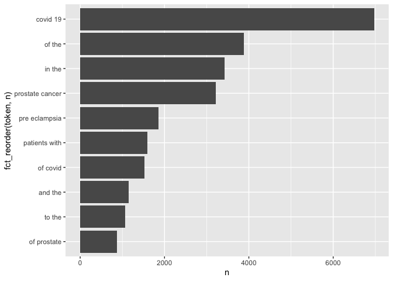

HW03
================
Luqing Ren
10/13/2020

## APIs

``` r
library(data.table)
library(tidyverse)
```

    ## ── Attaching packages ─────── tidyverse 1.3.0 ──

    ## ✓ ggplot2 3.3.2     ✓ purrr   0.3.4
    ## ✓ tibble  3.0.3     ✓ dplyr   1.0.2
    ## ✓ tidyr   1.1.2     ✓ stringr 1.4.0
    ## ✓ readr   1.3.1     ✓ forcats 0.5.0

    ## ── Conflicts ────────── tidyverse_conflicts() ──
    ## x dplyr::between()   masks data.table::between()
    ## x dplyr::filter()    masks stats::filter()
    ## x dplyr::first()     masks data.table::first()
    ## x dplyr::lag()       masks stats::lag()
    ## x dplyr::last()      masks data.table::last()
    ## x purrr::transpose() masks data.table::transpose()

``` r
library(xml2)
library(httr)
library(stringr)

# Using the NCBI API, look for papers that show up under the term "sars-cov-2 trial vaccine."Look for the data in the pubmed database.How many papers were you able to find?

# Downloading the website
website<- read_html("https://pubmed.ncbi.nlm.nih.gov/?term=sars-cov-2+trial+vaccine")
# Finding the counts
counts <- xml_find_first(website,"/html/body/main/div[9]/div[2]/div[2]/div[1]/span")
# Turning it into text
counts <- as.character(counts)
# Extracting the data using regex
stringr::str_extract(counts, "[0-9,]+")
```

    ## [1] "564"

  - There are 560 papers with term “sars-cov-2 trial vaccine”.

<!-- end list -->

``` r
# get academic publications
#Using the list of pubmed ids you retrieved, download each papers’ details using the query parameter rettype = abstract. If you get more than 250 ids, just keep the first 250.
query_ids <- GET(
  url   = "https://eutils.ncbi.nlm.nih.gov/entrez/eutils/esearch.fcgi",
  query = list(db ="pubmed",
  term ="sars-cov-2 trial vaccine",
   retmax = 1000
  )
   )
# Extracting the content of the response of GET
ids <- content(query_ids)
```

``` r
# Turn the result into a character vector
ids <- as.character(ids)

# Find all the ids 
ids <- str_extract_all(ids, "<Id>[0-9]+</Id>") 
ids<-ids [[1]]
# Remove all the leading and trailing <Id> </Id>. Make use of "|"
ids <- stringr::str_remove_all(ids, "<Id>|</Id>")
```

  - I get 227 ids.

<!-- end list -->

``` r
publications <- GET(
  url   = "https://eutils.ncbi.nlm.nih.gov/entrez/eutils/efetch.fcgi",
  query = list(
          db= "pubmed",
          id = paste(ids, collapse = ","),
          retmax = 1000,
          rettype ="abstract" 
          )
)

# Turning the output into character vector
publications <- content(publications)
publications_txt <- as.character(publications)
```

``` r
#We will use the `xml2::xml_children()` function to keep one element per id.
pub_char_list <- xml2::xml_children(publications)
pub_char_list <- sapply(pub_char_list, as.character)
```

``` r
# extract the abstract for each one of the elements of `pub_char_list`.
abstracts <- str_extract(pub_char_list, "<Abstract>(\\n|.)+</Abstract>")
abstracts <- str_remove_all(abstracts, "</?[[:alnum:]]+>")
abstracts <- str_replace_all(abstracts, "\\s+"," ")
```

``` r
titles <- str_extract(pub_char_list, "<ArticleTitle>(\\n|.)+</ArticleTitle>")
titles <- str_remove_all(titles, "</?[[:alnum:]]+>")
titles <- str_replace_all(titles, "\\s+"," ")
```

``` r
dates <- str_extract(pub_char_list, "<PubDate>(\\n|.)+</PubDate>")
dates <- str_remove_all(dates, "</?[[:alnum:]]+>")
dates <- str_replace_all(dates, "\\s+"," ")
```

``` r
journal <- str_extract(pub_char_list, "<Title>(\\n|.)+</Title>")
journal <- str_remove_all(journal, "</?[[:alnum:]]+>")
journal <- str_replace_all(journal, "\\s+"," ")
```

``` r
# put everything together into a single data frame.
dataset <- data.frame(
  PubMedID = ids,
  Title = titles,
  Abstracts = abstracts,
  Journal =journal,
  Data= dates
)
knitr::kable(dataset[1:3,])  # show the first three.
```

| PubMedID | Title                                                                             | Abstracts                                                                                                                                                                                                                                                                                                                                                                                                                                                                                                                                                                                                                                                                                                                                                                                                                                                                                                                                                                                                                                                                                                                                                                                                                                                                                                                                                                                                                                                                                                                                                                                                                                                                                                                                                                                                                                                                                                                                                                                                                                                                                | Journal                          | Data        |
| :------- | :-------------------------------------------------------------------------------- | :--------------------------------------------------------------------------------------------------------------------------------------------------------------------------------------------------------------------------------------------------------------------------------------------------------------------------------------------------------------------------------------------------------------------------------------------------------------------------------------------------------------------------------------------------------------------------------------------------------------------------------------------------------------------------------------------------------------------------------------------------------------------------------------------------------------------------------------------------------------------------------------------------------------------------------------------------------------------------------------------------------------------------------------------------------------------------------------------------------------------------------------------------------------------------------------------------------------------------------------------------------------------------------------------------------------------------------------------------------------------------------------------------------------------------------------------------------------------------------------------------------------------------------------------------------------------------------------------------------------------------------------------------------------------------------------------------------------------------------------------------------------------------------------------------------------------------------------------------------------------------------------------------------------------------------------------------------------------------------------------------------------------------------------------------------------------------------------- | :------------------------------- | :---------- |
| 33043110 | EXPLORING SURFACE GLYCOPROTEIN TO DESIGN MULTI-EPITOPE VACCINE AGAINST COVID-19.  | Stimulation and generation of T and B cell mediated long-term immune response is essential for the curbing of a deadly virus such as SAR-CoV-2. Immunoinformatics approach in vaccine design takes advantage of antigenic and non-allergenic epitopes present on the spike glycoprotein of SARS-CoV-2 to elicit immune responses. T cells and B cells epitopes were predicted, and the selected residues were subjected to allergenicity, antigenicity and toxicity screening which were linked by appropriate linkers to form a multi-epitope subunit vaccine. The physiochemical properties of the vaccine construct was analyzed and the molecular weight, molecular formula, theoretical isoelectric point value, half-life, solubility score, instability index, aliphatic index and GRAVY were predicted. The vaccine structure was constructed, refined, validated, and disulfide engineered to get the best model. Molecular binding simulation and molecular dynamics simulation were carried out to predict the stability and binding affinity of the vaccine construct with TLRs. Codon acclimatization and in silico cloning were performed to confirm the vaccine expression and potency. Results obtained indicated that this novel vaccine candidate is non-toxic, capable of initiating the immunogenic response and will not induce an allergic reaction. The highest binding energy was observed in TLR 4 (-1398.1) and the least is TLR 2 (-1479. 6). The steady rise in Th (helper) cell population with memory development was noticed and IFN-g was provoked after simulation. At this point, the vaccine candidate awaits animal trial to validate its efficacy and safety for use in the prevention of the novel COVID-19 infections. © 2020 The Author(s).                                                                                                                                                                                                                                                                                                      | Informatics in medicine unlocked | 2020 Oct 04 |
| 33042591 | Impact of COVID-19 on clinical trials and clinical research: A systematic review. | Background: The World Health Organization has reported more than 31,186,000 confirmed cases of coronavirus disease-19 (COVID-19), including 962,343 deaths, worldwide as on September 21, 2020. The current COVID-19 pandemic is affecting clinical research activities in most parts of the world. The focus on developing a vaccine for SARS-CoV-2 and the treatment of COVID-19 is, in fact, disrupting many upcoming and/or ongoing clinical trials on other diseases around the globe. On March 18, 2020, the United States Food and Drug Administration (FDA) issued an updated guideline for the conduct of clinical trials during the current health emergency situation. The potential challenges, such as social distancing and quarantines, result in study participants’ inaccessibility and trial personnel for in-person scheduled study visits and/or follow-up. Due to the sudden onset and wide-spread impact of COVID-19, its influence on the management of clinical trials and research necessitates urgent attention. Therefore, our systematic review of the literature aims to assess the impact of the COVID-19 pandemic on the conduction of clinical trials and research. The search for the relevant articles for review included the keywords “COVID-19” AND “clinical trial” in PubMed, MEDLINE, Embase, Google scholar and Google electronic databases. Key findings include: delaying subject enrollment and operational gaps in most ongoing clinical trials, which in turn has a negative impact on trial programmes and data integrity. Globally, most sites conducting clinical trials other than COVID-19 are experiencing a delay in timelines and a complete halt of operations in lieu of this pandemic, thus affecting clinical research outcomes. © 2020 CEA& INEA.                                                                                                                                                                                                                                                                             | Nepal journal of epidemiology    | 2020 Sep    |
| 33038433 | COVID-19: discovery, diagnostics and drug development.                            | An epidemic of acute respiratory syndrome (Covid-19) started in humans in Wuhan in 2019, and became a pandemic. Groups from China Identified and sequenced the virus responsible for COVID-19, named SARS-CoV-2, and determined that it was a novel coronavirus (CoV) that shared high sequence identity with bat- and pangolin-derived SARS-like CoVs, suggesting a zoonotic origin. SARS-CoV-2 is a member of Coronaviridae, a family of enveloped, positive-sense, single-stranded RNA viruses that infect a broad range of vertebrates. The rapid release of the sequence of the virus has allowed the development of diagnostic tools (e.g., RT-PCR). Additionally, serological tests can allow identification of persons who have been infected. In humans, CoVs tend to cause mild to moderate upper respiratory tract infections. The fatality rate is around 1-3% for infected persons. An acute respiratory distress syndrome (ARDS) likely due to an uncontrolled immune activation (“cytokine storm”) occurs in patients with severe disease and poor prognosis. Risk factors for mortality include: advanced age, obesity, diabetes, hypertension and other comorbidities. Drug repurposing has been used to rapidly identify potential treatment for COVID-19, which could move quickly to phase-3. Better knowledge of the virus, its enzymes, will be mandatory to develop more potent and specific direct-acting antiviral agents (DAA). In the long term, a vaccine to prevent infection would be crucial; however even if successful it might not be available before 2021-22. To date, with the exception of intravenous Remdesivir and dexamethasone, which have modest effects in moderate to severe COVID-19, no strong clinical evidence supports the efficacy and safety of any other drugs against SARS-CoV-2. The aim of this review is to provide insights on the discovery of SARS-CoV-2, its virology, the diagnostic tools, and the ongoing drug discovery effort. Copyright © 2020 European Association for the Study of the Liver. All rights reserved. | Journal of hepatology            | 2020 Oct 07 |

## Text Mining

1.Tokenize the abstracts and count the number of each token.Do you see
anything interesting? Does removing stop words change what tokens appear
as the most frequent? What are the 5 most common tokens for each search
term after removing stopwords?

``` r
# read the material
library(readr)
library(dplyr)
library(ggplot2)
library(tidytext)
library(tidyverse)
data <- read_csv("https://raw.githubusercontent.com/USCbiostats/data-science-data/master/03_pubmed/pubmed.csv")
```

    ## Parsed with column specification:
    ## cols(
    ##   abstract = col_character(),
    ##   term = col_character()
    ## )

``` r
#tokenize the abstracts and count
  data %>% 
  unnest_tokens(token,abstract) %>% 
  group_by(term) %>% 
  count(token,sort= TRUE) %>% 
  top_n(5,n)
```

    ## # A tibble: 25 x 3
    ## # Groups:   term [5]
    ##    term            token     n
    ##    <chr>           <chr> <int>
    ##  1 covid           the    9741
    ##  2 covid           of     7668
    ##  3 covid           covid  7275
    ##  4 preeclampsia    the    7119
    ##  5 covid           19     7035
    ##  6 covid           and    6861
    ##  7 preeclampsia    of     6837
    ##  8 prostate cancer the    6100
    ##  9 prostate cancer of     5682
    ## 10 preeclampsia    and    5255
    ## # … with 15 more rows

``` r
# remove stop words and number
nums <- as.character(seq(0,100))
data %>% 
unnest_tokens(word, abstract) %>%
group_by(term) %>% 
filter(!(word %in% nums)) %>% 
anti_join(stop_words, by= c("word")) %>% 
count(word, sort = TRUE) %>% 
top_n(5,n) 
```

    ## # A tibble: 26 x 3
    ## # Groups:   term [5]
    ##    term            word             n
    ##    <chr>           <chr>        <int>
    ##  1 covid           covid         7275
    ##  2 prostate cancer cancer        3840
    ##  3 prostate cancer prostate      3832
    ##  4 covid           patients      2293
    ##  5 preeclampsia    pre           2038
    ##  6 preeclampsia    eclampsia     2005
    ##  7 preeclampsia    preeclampsia  1863
    ##  8 preeclampsia    women         1196
    ##  9 preeclampsia    pregnancy      969
    ## 10 covid           disease        943
    ## # … with 16 more rows

  - The top 5 most frequent words almost are stop words.After removing
    stop words, the top 5 most frequent words are looks reliable.
  - The top 5 most common tokens after removing stopwords of “covid”
    search term are : covid,
    patients,disease,pandemic,coronavirus,health
  - The top 5 most common tokens after removing stopwords of “prostate
    cancer”search term are : cancer,prostate,patients,treatments,disease
  - The top 5 most common tokens after removing stopwords of
    “preeclampsia”search term are :
    pre,eclampsia,preeclampsia,women,pregnancy
  - The top 5 most common tokens after removing stopwords of “cystic
    fibrosis”search term are : fibrosis,cystic,cf,patients,disease
  - The top 5 most common tokens after removing stopwords of
    “meningitis”search term are :
    patients,meningitis,meningeal,csf,clinical

<!-- end list -->

``` r
## Tokenize the abstracts into bigrams.Find the 10 most common bigram and visualize them with ggplot2.
data %>% 
  unnest_ngrams(token,abstract, 2 ) %>% 
  count(token,sort= TRUE) %>% 
  top_n(10,n) %>% 
  ggplot(aes(n,fct_reorder(token,n)))+
  geom_col()
```

<!-- -->

  - The phrase are not much descriptive with bigrams.

<!-- end list -->

``` r
# Calculate the TF-IDF value for each word-search term combination. (here you want the search term to be the “document”) What are the 5 tokens from each search term with the highest TF-IDF value? How are the results different from the answers you got in question 1?

data %>% 
  unnest_tokens(token, abstract) %>% 
  group_by(term) %>% 
  filter(!(token %in% nums)) %>% 
  count(token, term) %>% 
  bind_tf_idf(token,term,n) %>% 
  arrange(desc(tf_idf)) 
```

    ## # A tibble: 38,747 x 6
    ## # Groups:   term [5]
    ##    term            token            n      tf   idf  tf_idf
    ##    <chr>           <chr>        <int>   <dbl> <dbl>   <dbl>
    ##  1 covid           covid         7275 0.0391  1.61  0.0629 
    ##  2 prostate cancer prostate      3832 0.0315  1.61  0.0507 
    ##  3 preeclampsia    eclampsia     2005 0.0146  1.61  0.0234 
    ##  4 preeclampsia    preeclampsia  1863 0.0135  1.61  0.0218 
    ##  5 meningitis      meningitis     429 0.00943 1.61  0.0152 
    ##  6 cystic fibrosis cf             625 0.0129  0.916 0.0118 
    ##  7 cystic fibrosis fibrosis       867 0.0179  0.511 0.00913
    ##  8 cystic fibrosis cystic         862 0.0178  0.511 0.00908
    ##  9 meningitis      meningeal      219 0.00481 1.61  0.00775
    ## 10 covid           pandemic       800 0.00430 1.61  0.00692
    ## # … with 38,737 more rows

  - The top 5 tokens with the highest TF-IDF value of “covid”search
    term: covid, pandemic, coronavirus, sars, cov

  - The top 5 tokens with the highest TF-IDF value of “prostate
    cancer”search term: prostate, androgen, psa,
    prostatectomy,castration

  - The top 5 tokens with the highest TF-IDF value of
    “preeclampsia”search term: eclampsia, preeclampsia,
    pregnancy,maternal,gestational

  - The top 5 tokens with the highest TF-IDF value of “cystic
    fibrosis”search term: cf, fibrosis, cystic, cftr, sweat

  - The top 5 tokens with the highest TF-IDF value of “meningitis”search
    term: meningitis, meningeal, pachymeningitis,csf,meninges

  - These top 5 tokens words with the highest TF-IDF value are more
    related to the search term than token words got in question 1. For
    instance, in “prostate cancer”search term, we got “androgen”, “psa”,
    “prostatectomy”,“castration” these specialized words.
